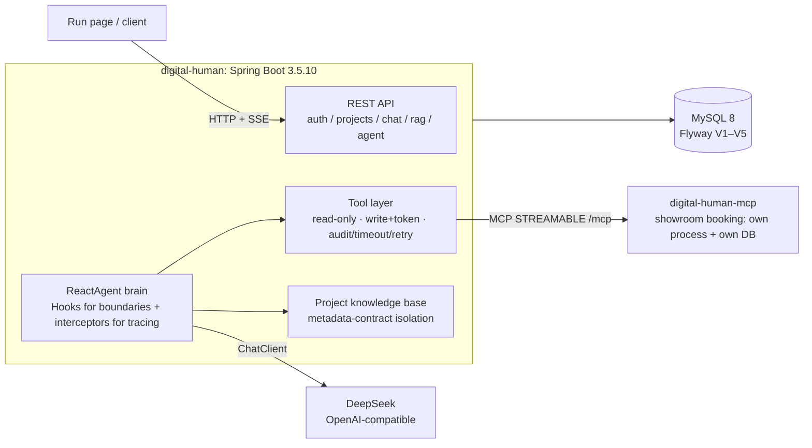

<div align="center">


# Learning Spring AI Alibaba in 18 moves

**After Spring AI 2.0 GA: how a Java team should "tame" an agent framework.**

Companion code for an 18-part article series — every chapter is a loop you can run, verify and roll back.

This is not a "type along and move on" sample dump. Each chapter gets its own branch, pull request
and tag, plus an acceptance record quoting **raw output** — real model responses, database queries,
log lines.

[](https://github.com/lifuchun522/springaialibabapractice/actions/workflows/ci.yml)
[](LICENSE)
[](pom.xml)
[](pom.xml)
[](pom.xml)
[](pom.xml)
[](#quick-start)
[](.github/pull_request_template.md)

[简体中文](README.md) · [English](README.en.md)

[Why now](#why-now-the-heat-is-in-the-framework-not-the-model) · [How to read](#three-reading-routes-do-not-binge-in-order) · [All 18 chapters](#all-18-chapters-articles--videos) · [Quick start](#quick-start) · [What you get](#what-you-get-and-what-you-can-verify-here) · [Articles](#the-article-series-three-more-judgements-worth-reading)

</div>

> One-line orientation: this is a Spring AI Alibaba practice series (pinned to the v1.1.2.2 production baseline) told through a single thread — a digital-human project. **18 articles + 18 videos**, all published on the Tencent Cloud developer community, running from selection and environment through to K8s rollout, with a verifiable completion criterion in every move. This repo is the **practice repository**: the series explains why each decision was made, the repo shows what actually happened when it ran.

| Three landing spots | What you get there |
| --- | --- |
| [Wiki home](https://github.com/lifuchun522/springaialibabapractice/wiki) | Series guide + one page per chapter (delivered, found, left over) |
| **This README** | The same guide + the deviations this repo measured |
| [`docs/chNN-*.md`](docs) | Per-chapter design docs and acceptance records (raw output, pitfalls) |
| [Projects](https://github.com/users/lifuchun522/projects/1) | One item per chapter: Done / In progress / Backlog |

---

## Why now: the heat is in the framework, not the model

Three things in the Java ecosystem became impossible to route around this year:

| When / what | What it actually changed for us |
| --- | --- |
| **Spring AI 2.0.0 GA** ([announcement](https://spring.io/blog/2026/06/12/spring-ai-2-0-0-GA-available-now)) | The abstraction layer is final: Advisor, Tool Calling, MCP, RAG, Observability are all stable. "Connecting Java to an AI model" stopped being the problem |
| **Spring AI Alibaba 1.0 GA + Agent Framework / Graph Runtime** ([blog](https://java2ai.com/blog/spring-ai-alibaba-1.0-ga-release/), [GitHub](https://github.com/alibaba/spring-ai-alibaba), [docs](https://java2ai.com)) | The agent layer and the graph runtime arrived, killing the "Java can only do CRUD around a model" stereotype |
| **A crowded field: AgentScope Java 2.0, several ADKs** | Selection stopped being "is there anything to choose" and became "how expensive is choosing wrong" — **framework choice is now an architecture decision, not a dependency coordinate** |

So the thing blocking Java teams is no longer "how do I get the model to answer", but
"now that it answers, how do I grow an agent on top without redoing the structure".

Most published content stops at the first stop. This series starts at the second one — and this
repository is the set of real commits behind it.

## Why most teams get stuck in the same place: the demo runs, the architecture does not

If your code looks like this, the series is written for you:

- The system prompt is a string literal in a controller, so ops needs a release to change a sentence;
- Session state lives in a `ConcurrentHashMap`, and two open browsers cross wires;
- "Look up an order" means one more `if-else`; RAG means another branch; multi-agent means a `role` field;
- Switching model vendors means editing `import` statements instead of configuration;
- When something breaks you only see the final text — not which tool ran, what was retrieved, which branch was taken.

Chapter 1 names this failure and explains why it is inevitable: **the old design is correct for
single-turn Q&A. Once requirements cross the line of stateful / multi-step / interruptible /
observable, what fails is not a piece of code but the whole structure.**

Same judgement, expressed as the trade-off rule of the series:

> Selection is boundary, boundary is cost, cost is architecture, architecture is trade-off.

## What "降" (tame) means here: not a downgrade, but bringing the framework under control

"降" means to subdue and hold, not to downgrade. The whole series does one thing repeatedly:
**compress new technology into an engineering-controllable range.** It shows up as three habits:

1. **Pin versions, do not chase the newest.** The production baseline is **v1.1.2.2**;
   `v2.0.0-M1.1` is watched only. Many `NoSuchMethodError`s are not bugs but late invoices for a
   selection decision — shipping a pre-release to production transfers version risk to the business.
   This repo turns that into a build gate, see [Baseline](#baseline-documented-is-not-enough-it-must-fail-validate).
2. **Draw boundaries before comparing features.** Put Spring AI, Spring AI Alibaba Extensions, Agent
   Framework, Graph Runtime and Admin/Studio in their proper layers, answer "which layer does my
   requirement belong to" first, and only then discuss modules.
3. **Add nothing you do not need.** Text completion only? The Spring AI base abstractions suffice.
   Not even multi-turn? A plain Java service plus one HTTP call is optimal. **A framework only pays
   off once the requirement crosses a threshold; below it, it is pure cost.**

## Three reading routes: do not binge in order

The 18 moves are **one dependency chain**, not 18 parallel articles. Reading out of order trips two
traps: the contracts used in move N were frozen in move N−1, and the troubleshooting section of move
N reproduces a failure left behind by move N−1.

| Route | For | Order | What you take away |
|-------|-----|-------|--------------------|
| **A** | Architects / tech leads | 1 → 9 → 10 → 13 → 15 | **Decision criteria**: should we use an agent at all, how far, hard-wired orchestration versus autonomous reasoning, where the MCP/A2A line sits, how to build evaluation |
| **B** | Backend / full-stack (already building AI features) | 1 → 2 → 3 → 4 → 5 → 6 → 7 → 8 | **A reusable base contract**: `projectId` as the single anchor, management path separated from the realtime path, reasoning growing in exactly one place |
| **C** | SRE / platform / QA (shipping and delivering) | 14 → 15 → 16 → 17 → 18 | **A deliverable evidence chain**: which line of code decides a behaviour → six regression sets → one traceId locating model / tool / RAG / graph node / remote agent → deploys that do not drop traffic, self-heal and roll back |

Chapter 3 has a line worth taping to your desk: *the thinner the base, the faster everything after it grows.*

> Current repo state: route B is complete, route A reaches chapter 12, route C starts at chapter 13
> — see [chapter progress](#chapter-progress-what-already-runs).

## All 18 chapters (articles + videos)

> Every move follows the same shape: **story → problem → principle → architecture → one real run →
> troubleshooting → tuning → insight → landing in the system**. Articles carry the reproducible
> detail; videos carry the reasoning. Articles and videos are **published on the Tencent Cloud
> developer community** and open without a login; videos are vertical, 3–5 minutes each. Article and
> video ids also live in [`scripts/build-wiki.py`](scripts/build-wiki.py), which generates the wiki pages.

| Ch | Topic | Article | Video |
|----|-------|---------|-------|
| 1 | 亢龙有悔 · Selection | [Ch 1](https://cloud.tencent.com/developer/article/2752108) | [▶ 87798](https://cloud.tencent.com/developer/video/87798) |
| 2 | 飞龙在天 · Environment | [Ch 2](https://cloud.tencent.com/developer/article/2752106) | [▶ 87796](https://cloud.tencent.com/developer/video/87796) |
| 3 | 见龙在田 · Base app | [Ch 3](https://cloud.tencent.com/developer/article/2752105) | [▶ 87794](https://cloud.tencent.com/developer/video/87794) |
| 4 | 鸿渐于陆 · Model | [Ch 4](https://cloud.tencent.com/developer/article/2752104) | [▶ 87793](https://cloud.tencent.com/developer/video/87793) |
| 5 | 潜龙勿用 · Memory & streaming | [Ch 5](https://cloud.tencent.com/developer/article/2752103) | [▶ 87792](https://cloud.tencent.com/developer/video/87792) |
| 6 | 利涉大川 · Tools | [Ch 6](https://cloud.tencent.com/developer/article/2752102) | [▶ 87791](https://cloud.tencent.com/developer/video/87791) |
| 7 | 突如其来 · MCP | [Ch 7](https://cloud.tencent.com/developer/article/2752101) | [▶ 87790](https://cloud.tencent.com/developer/video/87790) |
| 8 | 震惊百里 · RAG | [Ch 8](https://cloud.tencent.com/developer/article/2752097) | [▶ 87789](https://cloud.tencent.com/developer/video/87789) |
| 9 | 或跃在渊 · ReactAgent | [Ch 9](https://cloud.tencent.com/developer/article/2752096) | [▶ 87788](https://cloud.tencent.com/developer/video/87788) |
| 10 | 双龙取水 · Workflows | [Ch 10](https://cloud.tencent.com/developer/article/2752095) | [▶ 87787](https://cloud.tencent.com/developer/video/87787) |
| 11 | 鱼跃于渊 · Graph core | [Ch 11](https://cloud.tencent.com/developer/article/2752094) | [▶ 87786](https://cloud.tencent.com/developer/video/87786) |
| 12 | 时乘六龙 · Multi-agent | [Ch 12](https://cloud.tencent.com/developer/article/2752093) | [▶ 87785](https://cloud.tencent.com/developer/video/87785) |
| 13 | 密云不雨 · A2A | [Ch 13](https://cloud.tencent.com/developer/article/2752092) | [▶ 87784](https://cloud.tencent.com/developer/video/87784) |
| 14 | 损则有孚 · Source PR | [Ch 14](https://cloud.tencent.com/developer/article/2752091) | [▶ 87783](https://cloud.tencent.com/developer/video/87783) |
| 15 | 龙战于野 · Evaluation | [Ch 15](https://cloud.tencent.com/developer/article/2752089) | [▶ 87782](https://cloud.tencent.com/developer/video/87782) |
| 16 | 履霜冰至 · Service | [Ch 16](https://cloud.tencent.com/developer/article/2752087) | [▶ 87781](https://cloud.tencent.com/developer/video/87781) |
| 17 | 羝羊触藩 · Observability | [Ch 17](https://cloud.tencent.com/developer/article/2752086) | [▶ 87797](https://cloud.tencent.com/developer/video/87797) |
| 18 | 神龙摆尾 · K8s | [Ch 18](https://cloud.tencent.com/developer/article/2752084) | [▶ 87795](https://cloud.tencent.com/developer/video/87795) |

**How to watch**: the 18 videos map one-to-one onto the 18 articles. Articles give the reproducible
detail (versions, dependencies, troubleshooting, completion criteria); videos rehearse the **decision
process** — why this way, which alternatives were rejected, where the red lines are. The intended
rhythm is **video first for the trade-off, article second for the code**; reading the article first
tends to lose the decision inside the detail.

## Quick start

Running the tests needs **no API key and no database** (H2 in-memory plus a fake `ChatModel`,
fully offline):

```bash
git clone https://github.com/lifuchun522/springaialibabapractice.git
cd springaialibabapractice
./mvnw -B -ntp test
```

Running a real agent chain needs MySQL 8 and a DeepSeek key:

```bash
docker run -d --name dh-mysql -e MYSQL_ROOT_PASSWORD=root -p 33079:3306 mysql:8

export DEEPSEEK_API_KEY=sk-xxxx
export DIGITAL_HUMAN_DB_URL='jdbc:mysql://127.0.0.1:33079/digital_human?useUnicode=true&characterEncoding=utf8&serverTimezone=Asia/Shanghai'
export DIGITAL_HUMAN_DB_USER=root
export DIGITAL_HUMAN_DB_PASSWORD=root

./mvnw -pl digital-human spring-boot:run
```

```bash
# Smallest possible chain: no project, no knowledge base — just prove service + model channel are alive
curl -s "http://localhost:8080/api/chat?q=用一句话介绍你自己"
```

```bash
# Chapter 9 main path: one sentence in, one string out — plus the node sequence it took
# (create a project and ingest a document first, as shown in docs/ch09-验收记录.md)
curl -s -X POST http://localhost:8080/api/projects/1/agent/chat \
  -H 'Content-Type: application/json' \
  -d '{"question":"深圳展厅的开放时间是几点？周一开放吗？","sessionId":"demo"}'
```

```json
{
  "reply": "深圳展厅每天开放时间是早上九点到晚上六点，不过周一闭馆，所以要避开周一去哦。",
  "traceId": "b68e4df4ff75",
  "modelCalls": 2,
  "events": ["agent.start", "model#1", "tool:knowledge_search", "model#2", "agent.end"]
}
```

`reply` is what the UI consumes (the STT → Agent → TTS chain did not change);
`events` / `modelCalls` / `traceId` are for whoever debugs it.
**The first payoff of an agent framework is observability, not prettier answers.**

## What you get (and what you can verify here)

The series gives judgements; the repo gives evidence. Every chapter maps to a branch, a PR, a tag
and an acceptance record quoting raw output:

| Ch | Capability | What you can verify yourself |
|----|-----------|------------------------------|
| 1 | Selection and layering | Business code has exactly one `ChatClient` exit; no low-level model object leaks |
| 2 | Environment gate | JDK / Maven / dependency convergence failures break the `validate` phase |
| 3 | Digital-human base | Register/login, project CRUD, run page with SSE chat |
| 4 | Model governance | provider/model in the database, model catalog validation, deterministic error semantics (400 / 502 / 504) |
| 5 | Memory and ledger | Memory is a projection, `chat_message` is the fact; cancels and failures are recorded too |
| 6 | Tool gate | Read/write tools separated; writes need a single-use confirmation token; every call is audited, timed out and retried |
| 7 | MCP | Showroom booking split into its own process and database; the app discovers and calls it over MCP |
| 8 | RAG | Per-project knowledge base; isolation enforced by a **metadata contract**, not by retrieval luck; refuses when there is no basis |
| 9 | Agent brain | Full node event sequence, a hard cap on model calls, tool failures retried without killing the turn |
| 10 | Orchestration | Four flow-agent patterns — sequential / parallel / routing / looping — with node-level tracing |
| 11 | Graph runtime | Exportable, interruptible, resumable state graph; reduction strategies declared explicitly |
| 12 | Multi-agent | Three roles, each with its own prompt, tools and memory; router picks the first hop, handoffs are bounded |

### Three boundaries that hold across the whole repo

1. **The model never fills in identity.** Project/user ids travel out-of-band in `ToolContext`,
   never inside the tool's JSON Schema — the model cannot see them, so it cannot get them wrong.
2. **Failures stop at the tool boundary.** Bounded retries plus a fallback result hand the fact
   "this tool is unavailable right now" to the model instead of killing the conversation.
3. **Budgets live in engineering, not in the prompt.** Model calls per request have a hard cap and
   exceeding it ends the run **explicitly** (not by timeout), leaving event evidence behind.

### Deviations this repo measured (not copied from docs)

Docs give you APIs, articles give you direction, but "make the chain actually run and match the
acceptance criteria" is a stretch nobody walks with you: versions drift, parameter semantics change,
snippets do not hold on the version you installed. So the repo writes the deviations into
`docs/chNN-验收记录.md` (Chinese) instead of hiding them in commit messages:

| Ch | What the article says | What we measured here | What we did |
|----|-----------------------|-----------------------|-------------|
| 7 | A failed MCP client silently yields "no tools" | It throws `McpTransportException` (404 on `/sse`) — behaviour differs | Documented the gap; made an empty tool list a fail-fast at startup |
| 8 | `similarityThreshold` controls retrieval | Threshold 0 makes the "no basis, refuse" branch unreachable (score 0 still hits) | Wide candidate fetch from the store, separate relevance floor in business code |
| 9 | Attach the framework's tool-retry interceptor | Tool failures are already converted to readable results at the tool boundary, so the outer interceptor **never fires** | Failure policy owned by the tool boundary; no configured-but-dead channel left behind |
| 9 | Spring AI Alibaba and Spring AI share one version set | `agent-framework → graph-core` depends on MCP SDK **0.14.0** while Spring AI 1.1.2 uses **0.17.0**; the enforcer gate stops the build | Unified on 0.17.0 and proven with **real remote tool calls** (this also explains the chapter 7 protocol gap) |
| 10 | Routing accuracy is just "is the model good?" | Same 20 samples, same stated rules, three runs in a row: **17 / 16 / 16**. And the three "misses" were **our own mislabels** | Rules live in config, not in someone's head; routing calls pinned to `temperature: 0` → two reruns matched **line by line** |
| 11 | Reduction strategy is just "a setting" | When two parallel branches write the same key, `REPLACE` **silently loses data**: no exception, no log, output drops from 2 to 1 | Every used key declares its strategy; "what happens if you get it wrong" became a runnable contrast test |
| 12 | Splitting into multi-agent makes the system "more capable" | When three roles share tools and memory, the context budget is paid **every turn** (12 tool descriptions, related to the question or not); the router really did misroute once | Tool ownership frozen as "no two roles share a tool" (assertable); memory isolated per `role:sessionId`; the criterion is "one persona no longer fits", not "many tools" |

## Baseline: documented is not enough, it must fail `validate`



| Item | Value |
|------|-------|
| JDK | 21 LTS (enforcer pins `[21,22)`) |
| Maven | 3.9.11, supplied by the committed `./mvnw` (enforcer pins `[3.9,)`) |
| Spring Boot | 3.5.10 |
| Spring AI | 1.1.2 |
| Spring AI Alibaba | 1.1.2.2 (`v2.0.0-M1.1` is pre-release: watched, not shipped) |
| Model | DeepSeek, default `deepseek-flash` |
| Data | MySQL 8 + Flyway in runtime; H2 in tests |

The baseline is enforced, not documented: `mvnw` pins Maven, `requireJavaVersion` pins the JDK,
`dependencyConvergence` pins dependency versions — miss any of them and the build fails at `validate`
(it has already caught three real version divergences).

There is exactly **one model channel**: DeepSeek over the OpenAI-compatible protocol
(`spring.ai.model.chat=openai`, key from `DEEPSEEK_API_KEY`). The article series uses DashScope, but
this repo refuses to keep a configured-but-unused channel; it will be added in the chapter that
needs it. Without a key the service **refuses to start** (the SDK asserts a non-empty API key at
startup) — if the key is wrong, the service should not pretend to be healthy.

**Running both processes (from chapter 7 on)**:

```bash
# 1) MCP server (it owns its own database)
docker exec -i <mysql> mysql -uroot -proot -e "CREATE DATABASE IF NOT EXISTS digital_human_ext"
MCP_DB_URL='jdbc:mysql://127.0.0.1:33079/digital_human_ext?...' ./mvnw -pl digital-human-mcp spring-boot:run

# 2) Digital-human service (defaults to http://localhost:8081/mcp)
./mvnw -pl digital-human spring-boot:run
```

Startup logs should show `MCP 远程工具已发现 1 个：showroom_query_availability`. If the list is empty and
`digital-human.mcp.fail-fast=true`, the service **fails to start** and explains the common causes.

## Chapter progress: what already runs

| Ch | Hexagram · Topic | Branch | Tag | Status |
|----|------------------|--------|-----|--------|
| 1 | 亢龙有悔 · Selection | `chapter/01-value-selection` | `ch01` | ✅ Layering + single `ChatClient` exit |
| 2 | 飞龙在天 · Environment | `chapter/02-baseline-env` | `ch02` | ✅ mvnw + version gates + env self-check |
| 3 | 见龙在田 · Base app | `chapter/03-digital-human-demo` | `ch03` | ✅ Tables + auth + project CRUD + run page |
| 4 | 鸿渐于陆 · Model | `chapter/04-chat-model` | `ch04` | ✅ provider in DB + catalog + deterministic errors |
| 5 | 潜龙勿用 · Memory | `chapter/05-memory-streaming` | `ch05` | ✅ Memory + SSE streaming + message ledger |
| 6 | 利涉大川 · Tools | `chapter/06-tools` | `ch06` | ✅ Read/write split + human confirmation + audit & timeout |
| 7 | 突如其来 · MCP | `chapter/07-mcp` | `ch07` | ✅ Standalone MCP server + remote discovery and calls |
| 8 | 震惊百里 · RAG | `chapter/08-rag` | `ch08` | ✅ Per-project KB + metadata contract + cited answers, refusal without basis |
| 9 | 或跃在渊 · ReactAgent | `chapter/09-react-agent` | `ch09` | ✅ Event stream + hard model-call cap + tool-boundary retry + ledger |
| 10 | 双龙取水 · Workflows | `chapter/10-workflow-agents` | `ch10` | ✅ Four flow-agent patterns + node-level tracing (timings, emissions, sequence) |
| 11 | 鱼跃于渊 · Graph core | `chapter/11-graph-core` | `ch11` | ✅ State graph + explicit reduction strategies + interrupt + MySQL checkpoints (survives restart) |
| 12 | 时乘六龙 · Multi-agent | `chapter/12-multi-agent` | `ch12` | ✅ Three roles, each with its own prompt/tools/memory + router + handoff + max-hops |
| 13 | 密云不雨 · A2A | `chapter/13-a2a-nacos` | — | ⬜ Planned ([article](https://cloud.tencent.com/developer/article/2752092) and video already published) |
| 14 | 损则有孚 · Source PR | `chapter/14-source-pr` | — | ⬜ Planned ([article](https://cloud.tencent.com/developer/article/2752091) and video already published) |
| 15 | 龙战于野 · Evaluation | `chapter/15-eval-guard` | — | ⬜ Planned ([article](https://cloud.tencent.com/developer/article/2752089) and video already published) |
| 16 | 履霜冰至 · Service | `chapter/16-spring-service` | — | ⬜ Planned ([article](https://cloud.tencent.com/developer/article/2752087) and video already published) |
| 17 | 羝羊触藩 · Observability | `chapter/17-observability-admin` | — | ⬜ Planned ([article](https://cloud.tencent.com/developer/article/2752086) and video already published) |
| 18 | 神龙摆尾 · K8s | `chapter/18-k8s-production` | — | ⬜ Planned ([article](https://cloud.tencent.com/developer/article/2752084) and video already published) |

### Delivery flow: issue → branch → PR → main → tag

`main` is always the latest working state; no chapter writes to `main` directly:

```text
Issue (capability and acceptance criteria for this chapter)
   └─ branch chapter/NN-topic      ← this chapter only
        └─ PR (linked to the issue, with real verification evidence)
             └─ merge into main → tag chNN
```

Commits are `type(chNN): description`; the tag sits on the merge commit in `main` and its message
names the branch, the PR and what was delivered — so "what did chapter N actually ship" is answerable
from the tag itself.

## The article series: three more judgements worth reading

「降 SpringAI 阿里」十八掌 (Learning Spring AI Alibaba in 18 moves) on the Tencent Cloud developer
community, by 李福春. Every article and video link is in
[All 18 chapters](#all-18-chapters-articles--videos); the front door is
[chapter 1 · selection](https://cloud.tencent.com/developer/article/2752108)
([video](https://cloud.tencent.com/developer/video/87798)) — it decides whether the following 17
chapters make you rework anything.

If you only have time for three passages, take these — each is counter-intuitive **and** backed by evidence:

1. **On the realtime path, "one hop less" is often a pessimisation** (chapter 3): once the realtime
   process connects to the model itself, a second context and a second tool registry grow there —
   and **every later chapter has to be changed twice**.
2. **The model never executes code, it only writes arguments** (chapter 6): therefore **a prompt is
   not a security boundary**. "Please do not modify data" is a probabilistic constraint: it lowers
   the chance of an incident without changing the capability. Narrowing capability takes structure,
   not tone.
3. **The boundary of your tests is the boundary of your mocks** (chapter 15): mocking `ChatModel`
   entirely hard-codes "the model always returns the text we expect" — while model output is exactly
   the object under test, not a background condition.

**This is for you if**: you build AI / agent applications in Java or Spring Boot; you are choosing
between Spring AI, Spring AI Alibaba, AgentScope and LangChain4j and want an evidence-based
comparison; your project runs but every new requirement moves the structure; you need to deliver,
deploy and be evaluated rather than demo.

**Not for you if**: you want a "first ChatBot in 10 minutes" tutorial (official docs are faster);
you are on Python (except the protocol parts of chapters 7 and 13, everything here is a Spring-side
engineering decision); you want a ready-made framework — this content delivers **contracts and judgements**.

> Base first, then layers; layers first, then multiplicity; rails first, then visibility; visibility first, then shipping.

## Layout

```text
pom.xml                 Parent POM: BOM-managed versions + enforcer baseline gates
mvnw / mvnw.cmd         Maven Wrapper: the Maven version is pinned in the repo
digital-human/          The app: ChatClient exit, tools, memory, RAG, ReactAgent, MCP client
digital-human-mcp/      Showroom-booking MCP server: own process, own database
deploy/                 Docker Compose, remote deploy script, DingTalk notification
.github/workflows/      CI (build + test) and release (build → images → deploy → notify)
scripts/                Env self-check, wiki generator, Projects sync
docs/                   Series guide + per-chapter design docs and acceptance records
```

## Secrets

- Real keys live in environment variables only, or in a local `.env.local` / `application-local.yml`
  (both git-ignored).
- The repo only ever contains placeholders such as `.env.example` with `sk-xxxx`.
- Before committing: `git diff --cached | findstr sk-` — if a real key shows up, do not commit.

## Conventions

- Framework versions come from BOMs; submodules never declare them.
- Business code depends on `ChatClient` only, never on low-level model objects.
- One commit per chapter; messages are `type(chNN): description`.
- `.ps1` scripts are saved as UTF-8 with BOM (required by PowerShell 5.1).
- The single source of the series guide is `docs/系列导读.md`; the wiki (`Home` + one page per
  chapter) and Projects are generated by `scripts/build-wiki.py` and `scripts/sync-github-project.py`
  — do not edit them by hand.

## License

[Apache License 2.0](LICENSE).

<div align="center">

If this repo saved you some debugging, a **star** ⭐ helps. Found a gap? Open an issue with your raw output —
articles give direction, repos give evidence.

</div>
