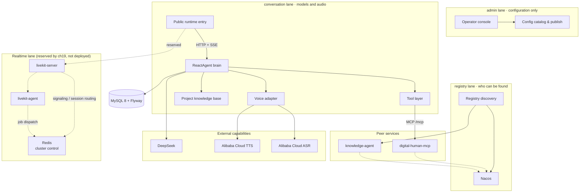

<div align="center">


# Learning Spring AI Alibaba in 18 moves

**After Spring AI 2.0 GA: how a Java team should "tame" an agent framework.**

Companion code for an 18-part article series: every chapter is **one branch, one PR, one tag**, plus an acceptance record quoting **raw output** — real model responses, database queries, log lines.

[](https://github.com/lifuchun522/springaialibabapractice/actions/workflows/ci.yml)
[](LICENSE)
[](pom.xml)
[](pom.xml)
[](pom.xml)
[](pom.xml)
[](#2-quick-start-one-command-brings-up-everything)
[](.github/pull_request_template.md)

[简体中文](README.md) · [English](README.en.md)

[1. Is it worth your time](#1-is-it-worth-your-time) · [2. Quick start](#2-quick-start-one-command-brings-up-everything) · [3. The 18 chapters](#3-the-18-chapters-articles-and-videos) · [4. Branches and tags](#4-branches-and-tags) · [Contributing](CONTRIBUTING.md)

</div>

> **In one line**: a Spring AI Alibaba practice series told through a single thread — a digital-human project (production baseline pinned to **v1.1.2.2**) — running from framework selection and environment through to a K8s rollout, with a verifiable completion criterion in every move. **The series explains why each decision was made; this repo shows what actually happened when it ran.**
>
> The baseline is enforced, not documented: JDK 21 LTS · Spring Boot 3.5.10 · Spring AI 1.1.2 · Spring AI Alibaba 1.1.2.2 · MySQL 8 + Flyway — miss it and the build fails at `validate`.

## 1. Is it worth your time?

**This is for you if**: you build AI or agent applications in **Java / Spring Boot**; you are choosing between Spring AI, Spring AI Alibaba, AgentScope and LangChain4j and want an **evidence-based** comparison; your project already runs but every new requirement moves the structure; you need to **deliver, deploy and be evaluated**, not just demo.

**Not for you if**: you want a "first ChatBot in 10 minutes" tutorial (official docs are faster); you are on **Python** (except the protocol parts of chapters 7 and 13); you want a ready-made framework — this content delivers **contracts and judgements**, not a product.

**Pick the route that matches your role** (the 18 moves are one dependency chain, not 18 parallel articles: the contracts used in move N were frozen in move N−1):

| Your role | Route | What you take away |
| --- | --- | --- |
| Architect / tech lead | Ch **1 → 9 → 10 → 13 → 15** | **Decision criteria**: should we use an agent at all, how far, hard-wired orchestration versus autonomous reasoning, where the MCP/A2A line sits, how to build evaluation |
| Backend / full-stack | Ch **1 → 2 → 3 → 4 → 5 → 6 → 7 → 8** | **A reusable base contract**: `projectId` as the single anchor, management path separated from the realtime path, reasoning growing in exactly one place |
| SRE / platform / QA | Ch **14 → 15 → 16 → 17 → 18** | **A deliverable evidence chain**: which line of code decides a behaviour → five test layers and six regression suites → one traceId locating model / tool / RAG / graph node / remote agent → deploys that do not drop traffic, self-heal and roll back |

**Three boundaries that hold across the whole repo**:

1. **The model never fills in identity.** Project/user ids travel out-of-band in `ToolContext`, never inside the tool's JSON Schema — the model cannot see them, so it cannot get them wrong.
2. **Failures stop at the tool boundary.** Bounded retries plus a fallback result hand the fact "this tool is unavailable right now" to the model instead of killing the conversation.
3. **Budgets live in engineering, not in the prompt.** Model calls per request have a hard cap and exceeding it ends the run **explicitly** (not by timeout), leaving event evidence behind.

**This diagram is the set of lanes this repo actually runs** (drawn separately, because "which lane does a new capability belong to" is the first question it must answer):



This diagram: **solid edges are lanes that really run; dashed edges are ch19's reserved slots, not working features** — `livekit-server` / `livekit-agent` need algorithm images and a GPU, so they are drawn but not deployed; running the realtime lane with more than one replica requires `Redis`, the **cluster control** for those two components (shared signaling routing and job dispatch) — it is reserved the same way and is **not** used for chat memory, whose source of truth stays the `chat_message` ledger; TTS / ASR are external dependencies and this repo ships only the adapter.

**This repo does not copy docs.** Deviations that only show up when you actually run the thing are written into [`docs/chNN-验收记录.md`](docs) (Chinese) with raw, reproducible output. Four of them:

| Ch | What we measured | What we did |
|----|------------------|-------------|
| 11 | When two parallel branches write the same key, `REPLACE` **silently loses data**: no exception, no log, output drops from 2 to 1 | Every used key declares its strategy, and "what happens if you get it wrong" became a runnable contrast test |
| 15 | A case whose **criterion was fully satisfied got 0 from the LLM judge**: the judge received the criterion and the answer but never the material that already stated the fact — **a judge that cannot see the facts calls facts fabrication** | Added a `reference` parameter to `LlmJudge` so retrieved material is handed over too; calibration samples now carry their own source material |
| 17 | One request carried **two traceIds**: our own in the response header, the framework's in the log — Micrometer's correlation decorator **writes the same MDC key**, so last writer wins | Identity now has a single source in the filter; afterwards header == log == audit table == call tree |
| 18 | Shipping to K8s is not "set replicas to 3": memory was **in-process**, so with several replicas a request hitting A and a session living in B looks like the AI forgot everything | Memory now reads the `chat_message` ledger (`store=jdbc`) — only then is the pod genuinely stateless |

## 2. Quick start: one command brings up everything

**No JDK, no Maven, no manual database setup.** The images compile from source, MySQL comes up with them, and Flyway migrations run inside the containers.

```bash
git clone https://github.com/lifuchun522/springaialibabapractice.git
cd springaialibabapractice/deploy

export DEEPSEEK_API_KEY=sk-xxxx
docker compose -f docker-compose.quickstart.yml up -d --build
```

The first run takes a few minutes (base images, dependency download, packaging); after that it is seconds. All three containers should be `healthy`:

```console
$ docker compose -f docker-compose.quickstart.yml ps
NAME            IMAGE                                    STATUS
dh-quick-mysql  mysql:8.0                                Up (healthy)
dh-quick-mcp    saa-quickstart/digital-human-mcp:local   Up (healthy)
dh-quick-app    saa-quickstart/digital-human:local       Up (healthy)
```

Now **open it in a browser**: <http://localhost:8080/run/1>


Everything on that screen is real, and everything on it is data: the title and opening line come from `digital_human_project`, the model name from `agent_config`, and the `1` in the address bar is the `projectId` — **the opening line changes without a release, just refresh the page**.

| To verify | How |
| --- | --- |
| The tool really was discovered over MCP | `docker compose -f docker-compose.quickstart.yml logs digital-human \| grep 工具` → expects `MCP 远程工具已发现 1 个：showroom_query_availability` |
| The schema was migrated by the app itself | `docker compose -f docker-compose.quickstart.yml logs digital-human \| grep Migrating` → expects the V1 migrations |
| Run tests only, no services | `./mvnw -B -ntp test` (**offline**: H2 + fake `ChatModel`, no keys, no database) |

Knobs all have defaults, so nothing must be set: `QUICK_APP_PORT` (8080), `QUICK_MCP_PORT` (8081), `QUICK_DB_PORT` (3307), `QUICK_DB_PASSWORD`;
tear down and wipe the database with `docker compose -f docker-compose.quickstart.yml down -v`.

> `deploy/docker-compose.quickstart.yml` is for **local experience** (built from source, bundled MySQL); `deploy/docker-compose.yml` deploys **pre-built images** (CI pushes images → the server runs `up -d`). Do not mix the two.

### Prefer no Docker? Run the two processes locally

```bash
docker run -d --name dh-mysql -e MYSQL_ROOT_PASSWORD=root -p 33079:3306 mysql:8

export DEEPSEEK_API_KEY=sk-xxxx
export DIGITAL_HUMAN_DB_URL='jdbc:mysql://127.0.0.1:33079/digital_human?useUnicode=true&characterEncoding=utf8&serverTimezone=Asia/Shanghai'
export DIGITAL_HUMAN_DB_USER=root
export DIGITAL_HUMAN_DB_PASSWORD=root

./mvnw -pl digital-human spring-boot:run
```

From chapter 7 on there is also a standalone MCP server (own process, own database `digital_human_ext`); the app defaults to `http://localhost:8081/mcp`.
Without a key the service **refuses to start** — if the key is wrong, the service should not pretend to be healthy.

### Five test layers; only the two offline ones run by default

```bash
./mvnw -B -ntp clean verify                                                                     # L1 unit + L2 component (the CI blocking path)
./mvnw -B -ntp test -pl digital-human -Dsurefire.groups=integration -Dsurefire.excludedGroups=   # L3 real MySQL container
./mvnw -B -ntp test -pl digital-human -Dsurefire.groups=eval -Dsurefire.excludedGroups=          # L4 recorded-answer replay
./mvnw -B -ntp test -pl digital-human -Dsurefire.groups=eval-live -Dsurefire.excludedGroups=     # L5 live evaluation (needs a key)
```

> `groups` and `excludedGroups` must always be passed **together**: Surefire gives exclusion priority, so `-Dsurefire.groups=integration` alone runs nothing at all — and still reports success.

## 3. The 18 chapters: articles and videos

All 18 articles and all 18 videos are **published on the Tencent Cloud developer community** (by 李福春); each link opens a new page — open them in a new tab, **one article plus one video per chapter**.
Articles carry the reproducible detail (environments and versions, dependencies and configuration, troubleshooting, completion criteria); videos rehearse the **decision process** in a "13-person round table": why this way, which alternatives were rejected, where the red lines are. Each video is 3–5 minutes.
You can also search the community for 「降SpringAI阿里」 to see all 18.

| Ch | Hexagram · Topic | Read | Watch |
|----|------------------|------|-------|
| 1 | 亢龙有悔 · Selection | [Article](https://cloud.tencent.com/developer/article/2752108) | [Video](https://cloud.tencent.com/developer/video/87798) |
| 2 | 飞龙在天 · Environment | [Article](https://cloud.tencent.com/developer/article/2752106) | [Video](https://cloud.tencent.com/developer/video/87796) |
| 3 | 见龙在田 · Base app | [Article](https://cloud.tencent.com/developer/article/2752105) | [Video](https://cloud.tencent.com/developer/video/87794) |
| 4 | 鸿渐于陆 · Model | [Article](https://cloud.tencent.com/developer/article/2752104) | [Video](https://cloud.tencent.com/developer/video/87793) |
| 5 | 潜龙勿用 · Memory & streaming | [Article](https://cloud.tencent.com/developer/article/2752103) | [Video](https://cloud.tencent.com/developer/video/87792) |
| 6 | 利涉大川 · Tools | [Article](https://cloud.tencent.com/developer/article/2752102) | [Video](https://cloud.tencent.com/developer/video/87791) |
| 7 | 突如其来 · MCP | [Article](https://cloud.tencent.com/developer/article/2752101) | [Video](https://cloud.tencent.com/developer/video/87790) |
| 8 | 震惊百里 · RAG | [Article](https://cloud.tencent.com/developer/article/2752097) | [Video](https://cloud.tencent.com/developer/video/87789) |
| 9 | 或跃在渊 · ReactAgent | [Article](https://cloud.tencent.com/developer/article/2752096) | [Video](https://cloud.tencent.com/developer/video/87788) |
| 10 | 双龙取水 · Workflows | [Article](https://cloud.tencent.com/developer/article/2752095) | [Video](https://cloud.tencent.com/developer/video/87787) |
| 11 | 鱼跃于渊 · Graph core | [Article](https://cloud.tencent.com/developer/article/2752094) | [Video](https://cloud.tencent.com/developer/video/87786) |
| 12 | 时乘六龙 · Multi-agent | [Article](https://cloud.tencent.com/developer/article/2752093) | [Video](https://cloud.tencent.com/developer/video/87785) |
| 13 | 密云不雨 · A2A | [Article](https://cloud.tencent.com/developer/article/2752092) | [Video](https://cloud.tencent.com/developer/video/87784) |
| 14 | 损则有孚 · Source PR | [Article](https://cloud.tencent.com/developer/article/2752091) | [Video](https://cloud.tencent.com/developer/video/87783) |
| 15 | 龙战于野 · Evaluation | [Article](https://cloud.tencent.com/developer/article/2752089) | [Video](https://cloud.tencent.com/developer/video/87782) |
| 16 | 履霜冰至 · Service | [Article](https://cloud.tencent.com/developer/article/2752087) | [Video](https://cloud.tencent.com/developer/video/87781) |
| 17 | 羝羊触藩 · Observability | [Article](https://cloud.tencent.com/developer/article/2752086) | [Video](https://cloud.tencent.com/developer/video/87797) |
| 18 | 神龙摆尾 · K8s | [Article](https://cloud.tencent.com/developer/article/2752084) | [Video](https://cloud.tencent.com/developer/video/87795) |

If you only have time for three passages, take these (each is counter-intuitive **and** backed by evidence):

1. **On the realtime path, "one hop less" is often a pessimisation** (ch 3): once the realtime process connects to the model itself, a second context and a second tool registry grow there — and every later chapter has to be changed twice.
2. **The model never executes code, it only writes arguments** (ch 6): therefore **a prompt is not a security boundary** — narrowing capability takes structure, not tone.
3. **The boundary of your tests is the boundary of your mocks** (ch 15): mocking `ChatModel` entirely hard-codes "the model always returns the text we expect", while model output is exactly the object under test.

## 4. Branches and tags

`main` is always the latest working state, and **no chapter ever writes to `main` directly**:

```text
Issue (capability and acceptance criteria for this chapter)
   └─ branch chapter/NN-topic      ← this chapter only
        └─ PR (linked to the issue, with real verification evidence)
             └─ merge into main → tag chNN
```

- **Branch**: `chapter/NN-topic`, one per chapter, carrying only that chapter's changes. Branches for chapters 1–14 are kept on the remote for direct comparison; from chapter 15 on they are cleaned up after merge, so go by tag.
- **Tag**: `chNN`, placed on that chapter's merge commit in `main`. The tag message names the **branch, the PR and what the chapter delivered/verified** — `git show ch16 --no-patch` answers "what did chapter 16 actually ship, and how was it verified" without digging through the PR.
- **Reading one chapter's code**: `git switch --detach ch11`, or `git diff ch10 ch11` to see only what that chapter changed.
- **Non-chapter tag `v0.1.0`**: first release of the repository operations work (GitHub Ops: issues, PRs, discussions, Pages, security governance) — unrelated to the 18 chapters.
- **Chapter 19**: diagram and plan are ready ([ch19 doc](docs/ch19-数字人功能升级.md), [OpenSpec change](openspec/changes/ch19-digital-human-upgrade/)), no tag yet.

| Ch | Hexagram · Topic | Branch | Tag |
|----|------------------|--------|-----|
| 1 | 亢龙有悔 · Selection | `chapter/01-value-selection` | `ch01` |
| 2 | 飞龙在天 · Environment | `chapter/02-baseline-env` | `ch02` |
| 3 | 见龙在田 · Base app | `chapter/03-digital-human-demo` | `ch03` |
| 4 | 鸿渐于陆 · Model | `chapter/04-chat-model` | `ch04` |
| 5 | 潜龙勿用 · Memory | `chapter/05-memory-streaming` | `ch05` |
| 6 | 利涉大川 · Tools | `chapter/06-tools` | `ch06` |
| 7 | 突如其来 · MCP | `chapter/07-mcp` | `ch07` |
| 8 | 震惊百里 · RAG | `chapter/08-rag` | `ch08` |
| 9 | 或跃在渊 · ReactAgent | `chapter/09-react-agent` | `ch09` |
| 10 | 双龙取水 · Workflows | `chapter/10-workflow-agents` | `ch10` |
| 11 | 鱼跃于渊 · Graph core | `chapter/11-graph-core` | `ch11` |
| 12 | 时乘六龙 · Multi-agent | `chapter/12-multi-agent` | `ch12` |
| 13 | 密云不雨 · A2A | `chapter/13-a2a-nacos` | `ch13` |
| 14 | 损则有孚 · Source PR | `chapter/14-source-pr` | `ch14` |
| 15 | 龙战于野 · Evaluation | `chapter/15-eval-guard` | `ch15` |
| 16 | 履霜冰至 · Service | `chapter/16-spring-service` | `ch16` |
| 17 | 羝羊触藩 · Observability | `chapter/17-observability-admin` | `ch17` |
| 18 | 神龙摆尾 · K8s | `chapter/18-k8s-production` | `ch18` |
| 19 | 震雷百里 · Digital-human upgrade | 🚧 not yet cut | — |

## Layout and conventions

```text
digital-human/         The app: ChatClient exit, tools, memory, RAG, ReactAgent, MCP client
digital-human-mcp/     Showroom-booking MCP server: own process, own database
knowledge-agent/       A2A knowledge agent: own process, capability card
deploy/                Docker Compose, K8s manifests, remote deploy script
docs/                  Series guide + per-chapter design docs and acceptance records
scripts/               Env self-check, wiki generator, Projects sync, per-chapter evidence
```

- Read [CONTRIBUTING.md](CONTRIBUTING.md) before opening an issue or PR; if you are unsure whether something is a defect, use [Discussions](https://github.com/lifuchun522/springaialibabapractice/discussions).
- Real keys live in **environment variables only**, or in a local `.env.local` / `application-local.yml` (both git-ignored); the repo only ever contains placeholders such as `sk-xxxx`.
- The single source of the series guide is [`docs/系列导读.md`](docs/系列导读.md); the wiki and Projects are generated by [`scripts/build-wiki.py`](scripts/build-wiki.py) and [`scripts/sync-github-project.py`](scripts/sync-github-project.py) — **do not edit them by hand**.

## License

[Apache License 2.0](LICENSE).

<div align="center">

If this repo saved you some debugging, a **star** ⭐ helps. Found a gap? Open an issue with your raw output — articles give direction, repos give evidence.

</div>
