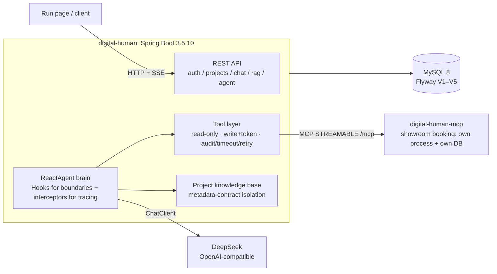

<div align="center">


**Companion code for an 18-part article series: every chapter is a loop you can run, verify and roll back.**

This is not a "type along and move on" sample dump. Each chapter gets its own branch, pull request
and tag, plus an acceptance record quoting **raw output** — real model responses, database queries,
log lines.

[](LICENSE)
[](pom.xml)
[](pom.xml)
[](pom.xml)
[](pom.xml)
[](#quick-start)
[](.github/pull_request_template.md)

[简体中文](README.md) · [English](README.en.md)

[Quick start](#quick-start) · [What you get](#what-you-get) · [Architecture](#architecture) · [Progress](#chapter-progress) · [Articles](#the-article-series)

</div>

## Why this repo exists

Docs give you APIs, articles give you direction. Nobody walks with you through the part where
**the chain actually runs and matches the acceptance criteria** — versions drift, parameter
semantics change, and snippets from the article simply do not hold on the version you installed.

So this repo writes the deviations down instead of hiding them:

| Ch | What the article says | What we measured here | What we did |
|----|-----------------------|-----------------------|-------------|
| 7 | A failed MCP client silently yields "no tools" | It throws `McpTransportException` (404 on `/sse`) — behaviour differs | Documented the gap; made an empty tool list a fail-fast at startup |
| 8 | `similarityThreshold` controls retrieval | Threshold 0 makes the "no basis, refuse" branch unreachable (score 0 still hits) | Wide candidate fetch from the store, separate relevance floor in business code |
| 9 | Attach the framework's tool-retry interceptor | Tool failures are already converted to readable results at the tool boundary, so the outer interceptor **never fires** | Failure policy owned by the tool boundary; no configured-but-dead channel left behind |

Every such finding lives in the "核验发现与踩坑" section of `docs/chNN-验收记录.md`
(Chinese), not buried in a commit message.

## Quick start

Running the tests needs **no API key and no database** (H2 in-memory plus a fake `ChatModel`,
fully offline):

```bash
git clone https://github.com/lifchun522/springaialibabapractice.git
cd springaialibabapractice
./mvnw -B -ntp test
```

Running a real agent chain needs MySQL 8 and a DeepSeek key:

```bash
docker run -d --name dh-mysql -e MYSQL_ROOT_PASSWORD=root -p 33079:3306 mysql:8

export DEEPSEEK_API_KEY=sk-xxxx
export DIGITAL_HUMAN_DB_URL='jdbc:mysql://127.0.0.1:33079/digital_human?useUnicode=true&characterEncoding=utf8&serverTimezone=Asia/Shanghai'
export DIGITAL_HUMAN_DB_USER=root
export DIGITAL_HUMAN_DB_PASSWORD=root

./mvnw -pl digital-human spring-boot:run
```

```bash
# Smallest possible chain: no project, no knowledge base — just prove service + model channel are alive
curl -s "http://localhost:8080/api/chat?q=用一句话介绍你自己"
```

```bash
# Chapter 9 main path: one sentence in, one string out — plus the node sequence it took
# (create a project and ingest a document first, as shown in docs/ch09-验收记录.md)
curl -s -X POST http://localhost:8080/api/projects/1/agent/chat \
  -H 'Content-Type: application/json' \
  -d '{"question":"深圳展厅的开放时间是几点？周一开放吗？","sessionId":"demo"}'
```

```json
{
  "reply": "深圳展厅每天开放时间是早上九点到晚上六点，不过周一闭馆，所以要避开周一去哦。",
  "traceId": "b68e4df4ff75",
  "modelCalls": 2,
  "events": ["agent.start", "model#1", "tool:knowledge_search", "model#2", "agent.end"]
}
```

`reply` is what the UI consumes (the STT → Agent → TTS chain did not change);
`events` / `modelCalls` / `traceId` are for whoever debugs it.
**The first payoff of an agent framework is observability, not prettier answers.**

## What you get

| Ch | Capability | What you can verify yourself |
|----|-----------|------------------------------|
| 1 | Selection and layering | Business code has exactly one `ChatClient` exit; no low-level model object leaks |
| 2 | Environment gate | JDK / Maven / dependency convergence failures break the `validate` phase |
| 3 | Digital-human base | Register/login, project CRUD, run page with SSE chat |
| 4 | Model governance | provider/model in the database, model catalog validation, deterministic error semantics (400 / 502 / 504) |
| 5 | Memory and ledger | Memory is a projection, `chat_message` is the fact; cancels and failures are recorded too |
| 6 | Tool gate | Read/write tools separated; writes need a single-use confirmation token; every call is audited, timed out and retried |
| 7 | MCP | Showroom booking split into its own process and database; the app discovers and calls it over MCP |
| 8 | RAG | Per-project knowledge base; isolation enforced by a **metadata contract**, not by retrieval luck; refuses when there is no basis |
| 9 | Agent brain | Full node event sequence, a hard cap on model calls, tool failures retried without killing the turn |

Three boundaries that hold across the whole repo:

1. **The model never fills in identity.** Project/user ids travel out-of-band in `ToolContext`,
   never inside the tool's JSON Schema — the model cannot see them, so it cannot get them wrong.
2. **Failures stop at the tool boundary.** Bounded retries plus a fallback result hand the fact
   "this tool is unavailable right now" to the model instead of killing the conversation.
3. **Budgets live in engineering, not in the prompt.** Model calls per request have a hard cap and
   exceeding it ends the run **explicitly** (not by timeout), leaving event evidence behind.

## Architecture



## Baseline

| Item | Value |
|------|-------|
| JDK | 21 LTS (enforcer pins `[21,22)`) |
| Maven | 3.9.11, supplied by the committed `./mvnw` (enforcer pins `[3.9,)`) |
| Spring Boot | 3.5.10 |
| Spring AI | 1.1.2 |
| Spring AI Alibaba | 1.1.2.2 (`v2.0.0-M1.1` is pre-release: watched, not shipped) |
| Model | DeepSeek, default `deepseek-flash` |
| Data | MySQL 8 + Flyway in runtime; H2 in tests |

The baseline is enforced, not documented: `mvnw` pins Maven, `requireJavaVersion` pins the JDK,
`dependencyConvergence` pins dependency versions — miss any of them and the build fails at `validate`.

There is exactly **one model channel**: DeepSeek over the OpenAI-compatible protocol
(`spring.ai.model.chat=openai`, key from `DEEPSEEK_API_KEY`). The article series uses DashScope, but
this repo refuses to keep a configured-but-unused channel; it will be added in the chapter that
needs it. Without a key the service **refuses to start** (the SDK asserts a non-empty API key at
startup) — if the key is wrong, the service should not pretend to be healthy.

## Running both processes (from chapter 7 on)

```bash
# 1) MCP server (it owns its own database)
docker exec -i <mysql> mysql -uroot -proot -e "CREATE DATABASE IF NOT EXISTS digital_human_ext"
MCP_DB_URL='jdbc:mysql://127.0.0.1:33079/digital_human_ext?...' ./mvnw -pl digital-human-mcp spring-boot:run

# 2) Digital-human service (defaults to http://localhost:8081/mcp)
./mvnw -pl digital-human spring-boot:run
```

Startup logs should show `MCP 远程工具已发现 1 个：showroom_query_availability`. If the list is empty and
`digital-human.mcp.fail-fast=true`, the service **fails to start** and explains the common causes.

## Delivery flow: issue → branch → PR → main → tag

`main` is always the latest working state; no chapter writes to `main` directly:

```text
Issue (capability and acceptance criteria for this chapter)
   └─ branch chapter/NN-topic      ← this chapter only
        └─ PR (linked to the issue, with real verification evidence)
             └─ merge into main → tag chNN
```

Commits are `type(chNN): description`; the tag sits on the merge commit in `main` and its message
names the branch, the PR and what was delivered — so "what did chapter N actually ship" is answerable
from the tag itself.

## Chapter progress

| Ch | Hexagram · Topic | Branch | Tag | Status |
|----|------------------|--------|-----|--------|
| 1 | 亢龙有悔 · Selection | `chapter/01-value-selection` | `ch01` | ✅ Layering + single `ChatClient` exit |
| 2 | 飞龙在天 · Environment | `chapter/02-baseline-env` | `ch02` | ✅ mvnw + version gates + env self-check |
| 3 | 见龙在田 · Base app | `chapter/03-digital-human-demo` | `ch03` | ✅ Tables + auth + project CRUD + run page |
| 4 | 鸿渐于陆 · Model | `chapter/04-chat-model` | `ch04` | ✅ provider in DB + catalog + deterministic errors |
| 5 | 潜龙勿用 · Memory | `chapter/05-memory-streaming` | `ch05` | ✅ Memory + SSE streaming + message ledger |
| 6 | 利涉大川 · Tools | `chapter/06-tools` | `ch06` | ✅ Read/write split + human confirmation + audit & timeout |
| 7 | 突如其来 · MCP | `chapter/07-mcp` | `ch07` | ✅ Standalone MCP server + remote discovery and calls |
| 8 | 震惊百里 · RAG | `chapter/08-rag` | `ch08` | ✅ Per-project KB + metadata contract + cited answers, refusal without basis |
| 9 | 或跃在渊 · ReactAgent | `chapter/09-react-agent` | — | 🚧 Event stream + model-call cap + tool retry (verifying for real) |
| 10 | 双龙取水 · Workflows | `chapter/10-workflow-agents` | — | ⬜ Planned |
| 11 | 鱼跃于渊 · Graph core | `chapter/11-graph-core` | — | ⬜ Planned |
| 12 | 时乘六龙 · Multi-agent | `chapter/12-multi-agent` | — | ⬜ Planned |
| 13 | 密云不雨 · A2A | `chapter/13-a2a-nacos` | — | ⬜ Planned |
| 14 | 损则有孚 · Source PR | `chapter/14-source-pr` | — | ⬜ Planned |
| 15 | 龙战于野 · Evaluation | `chapter/15-eval-guard` | — | ⬜ Planned |
| 16 | 履霜冰至 · Service | `chapter/16-spring-service` | — | ⬜ Planned |
| 17 | 羝羊触藩 · Observability | `chapter/17-observability-admin` | — | ⬜ Planned |
| 18 | 神龙摆尾 · K8s | `chapter/18-k8s-production` | — | ⬜ Planned |

## The article series

「降 SpringAI 阿里」十八掌 (`Learning Spring AI Alibaba in 18 moves`), on the Tencent Cloud developer
community, by 李福春. Articles are in Chinese:

| Ch | Article | Ch | Article |
|----|---------|----|---------|
| 1 | [Selection](https://cloud.tencent.com/developer/article/2752108) | 10 | [Workflows](https://cloud.tencent.com/developer/article/2752095) |
| 2 | [Environment](https://cloud.tencent.com/developer/article/2752106) | 11 | [Graph core](https://cloud.tencent.com/developer/article/2752094) |
| 3 | [Base app](https://cloud.tencent.com/developer/article/2752105) | 12 | [Multi-agent](https://cloud.tencent.com/developer/article/2752093) |
| 4 | [Model](https://cloud.tencent.com/developer/article/2752104) | 13 | [A2A](https://cloud.tencent.com/developer/article/2752092) |
| 5 | [Memory & streaming](https://cloud.tencent.com/developer/article/2752103) | 14 | [Source PR](https://cloud.tencent.com/developer/article/2752091) |
| 6 | [Tools](https://cloud.tencent.com/developer/article/2752102) | 15 | [Evaluation](https://cloud.tencent.com/developer/article/2752089) |
| 7 | [MCP](https://cloud.tencent.com/developer/article/2752101) | 16 | [Service](https://cloud.tencent.com/developer/article/2752087) |
| 8 | [RAG](https://cloud.tencent.com/developer/article/2752097) | 17 | [Observability](https://cloud.tencent.com/developer/article/2752086) |
| 9 | [ReactAgent](https://cloud.tencent.com/developer/article/2752096) | 18 | [K8s](https://cloud.tencent.com/developer/article/2752084) |

## One body of content, three audiences

| Where | For | What |
|-------|-----|------|
| [`docs/chNN-*.md`](docs) | People following along | Full design doc + acceptance record with raw output and pitfalls |
| [Wiki](https://github.com/lifchun522/springaialibabapractice/wiki) | People who want the summary | Background + one page per chapter, generated from `docs` |
| [Projects](https://github.com/users/lifchun522/projects/1) | People tracking progress | One item per chapter: Done / In progress / Backlog |

Wiki and Projects are script-generated — do not edit them by hand:
`python scripts/build-wiki.py`, `python scripts/sync-github-project.py`.

## Layout

```text
pom.xml                 Parent POM: BOM-managed versions + enforcer baseline gates
mvnw / mvnw.cmd         Maven Wrapper: the Maven version is pinned in the repo
digital-human/          The app: ChatClient exit, tools, memory, RAG, ReactAgent, MCP client
digital-human-mcp/      Showroom-booking MCP server: own process, own database
deploy/                 Docker Compose, remote deploy script, DingTalk notification
.github/workflows/      CI (build + test) and release (build → images → deploy → notify)
scripts/                Env self-check, wiki generator, Projects sync
docs/                   Per-chapter design docs and acceptance records
```

## Secrets

- Real keys live in environment variables only, or in a local `.env.local` / `application-local.yml`
  (both git-ignored).
- The repo only ever contains placeholders such as `.env.example` with `sk-xxxx`.
- Before committing: `git diff --cached | findstr sk-` — if a real key shows up, do not commit.

## Conventions

- Framework versions come from BOMs; submodules never declare them.
- Business code depends on `ChatClient` only, never on low-level model objects.
- One commit per chapter; messages are `type(chNN): description`.
- `.ps1` scripts are saved as UTF-8 with BOM (required by PowerShell 5.1).

## License

[Apache License 2.0](LICENSE).

<div align="center">

If this repo saved you some debugging, a **star** ⭐ helps. Found a gap? Open an issue with your raw output —
articles give direction, repos give evidence.

</div>
