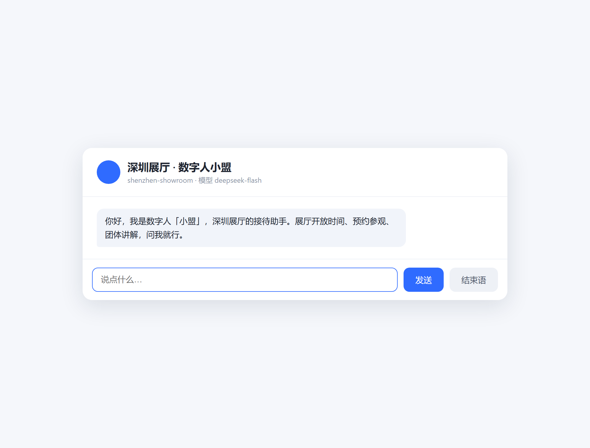
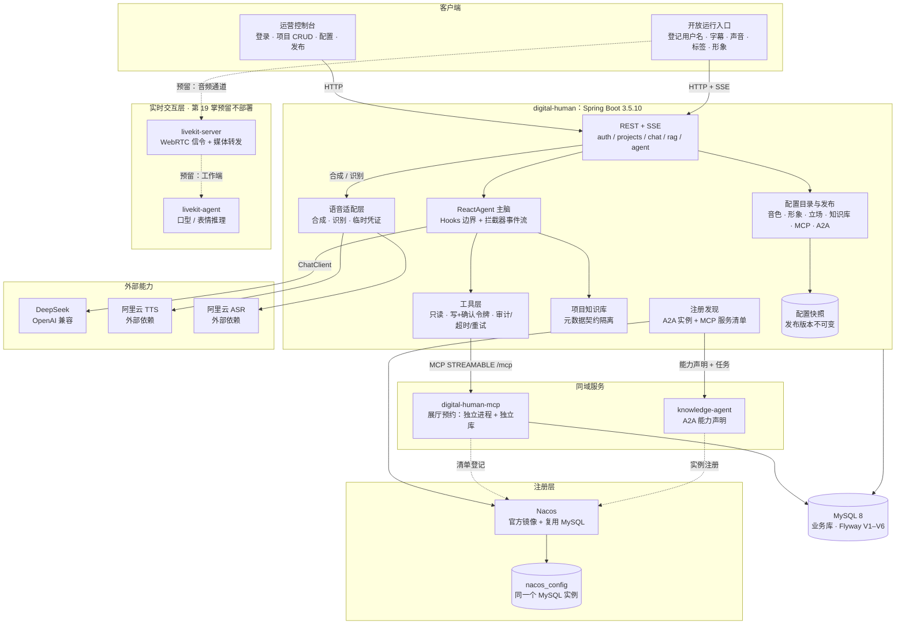

<div align="center">


# 降·Spring AI 阿里 18 掌

**Spring AI 2.0 GA 之后，Java 团队的 Agent 框架该怎么「降」。**

18 篇文章 + 18 集视频的配套代码仓：每一掌都是一个能跑、能验收、能回滚的闭环。

不是「跟着敲一遍就完」的示例集合。每掌一条分支、一个 PR、一个 tag，
外加一份贴着**原始输出**（真实模型返回、数据库查询、日志行）的验收记录。

[](https://github.com/lifuchun522/springaialibabapractice/actions/workflows/ci.yml)
[](LICENSE)
[](pom.xml)
[](pom.xml)
[](pom.xml)
[](pom.xml)
[](#七一键启动docker-compose-一条命令)
[](.github/pull_request_template.md)

[简体中文](README.md) · [English](README.en.md)

[读哪几掌](#五读哪几掌按角色选路线) · [18 掌目录](#六18-掌目录文章--视频) · [一键启动](#七一键启动docker-compose-一条命令) · [能学到什么](#九能学到什么本仓库能核验到什么) · [文章系列](#十二文章系列还有三处判断值得单独拎出来) · [运维治理](docs/github-ops/README.md)

</div>

> **首屏五段**（新访客三步：看懂项目 → 找到快速开始 → 知道去哪提问；完整索引见 [docs/github-ops/README.md](docs/github-ops/README.md)）
>
> | 段 | 这一屏给你什么 | 去看 |
> | --- | --- | --- |
> | ① 项目定位 | 一套以数字人项目为线索的 Spring AI Alibaba 实战系列（18 篇文章 + 18 集视频）的**练习仓库**：系列讲「为什么这么定」，本仓摆「实测成什么样」 | 本文下方「一句话导读」与[一、先看这一屏](#一先看这一屏30-秒判断要不要往下读) |
> | ② 快速开始 | `docker compose` 一条命令起全套；不想用 Docker 就在本机起两个进程 | [七、一键启动](#七一键启动docker-compose-一条命令) |
> | ③ 掌次路线 | 18 掌的分支 / tag / 进度表，按角色选一条线读 | [五、按角色选路线](#五读哪几掌按角色选路线)、[六、18 掌目录](#六18-掌目录文章--视频)、[十一、进度表](#十一18-掌进度一眼看完哪一掌已经能跑) |
> | ④ 技术栈 | JDK 21 / Spring Boot 3.5.10 / Spring AI 1.1.2 / Spring AI Alibaba 1.1.2.2，基线由 `validate` 门禁守住 | [十、技术基线](#十技术基线写在文档里不算数过不了-validate-才算)、[`pom.xml`](pom.xml) |
> | ⑤ 参与贡献 | 提 Issue 请先读 [CONTRIBUTING.md](CONTRIBUTING.md)；提问与不确定是不是缺陷的，走 [Discussions](https://github.com/lifuchun522/springaialibabapractice/discussions) | [CONTRIBUTING.md](CONTRIBUTING.md)、[Issue 模板](.github/ISSUE_TEMPLATE)、[PR 模板](.github/pull_request_template.md) |
>

> **一句话导读**：这是一套以**数字人项目**为唯一线索的 Spring AI Alibaba 实战系列（锁定 v1.1.2.2 生产基线）——**18 篇文章 + 18 集视频**已全部发布在腾讯云开发者社区，从选型、环境、底座一路打到 K8s 上线，每一掌都给出可验证的完成标准。本仓库是它的**练习仓库**：系列负责告诉你「为什么这么定」，仓库负责把「实测成什么样」摆出来。

| 如果你…… | 直接去 |
| --- | --- |
| 想知道这套内容适不适合自己 | [一、先看这一屏](#一先看这一屏30-秒判断要不要往下读) |
| 想知道「为什么现在要关心 Agent 框架」 | [二、为什么是现在](#二为什么是现在热的不是模型是框架) |
| 已经踩过「能跑，但一改需求就动结构」 | [三、Demo 通、架构不通](#三为什么大多数人卡在同一处demo-通架构不通) |
| 只想知道该读哪几掌 | [五、按角色选路线](#五读哪几掌按角色选路线) |
| 先把整套跑起来看效果 | [七、一键启动](#七一键启动docker-compose-一条命令) |
| 想看本仓库实测出了什么偏差 | [八、实测偏差](#八实测与文章的偏差不是抄文档) |

---

## 一、先看这一屏：30 秒判断要不要往下读

**这套内容适合你，如果：**

- 你在做 AI 应用或 Agent 应用，技术栈是 **Java / Spring Boot**；
- 你正在选型 Spring AI、Spring AI Alibaba、AgentScope、LangChain4j，需要一份**带证据**的对比口径；
- 你的项目已经「能跑」，但**一加需求就要动结构**，团队不敢往上叠；
- 你要**交付、上线、被评测**，而不只是做个演示。

**不适合你，如果：**

- 你只想找一份「10 分钟写出第一个 ChatBot」的快速入门——官方文档和 examples 更快；
- 你是 **Python** 技术栈——除第 7、13 掌的协议部分，其余都是 Spring 侧的工程决策；
- 你在找一键可跑的成品框架——这套内容给的是**契约与判断**，不是成品代码。

**同一份内容有三个落点，按你的耐心挑一个：**

| 落点 | 给你什么 |
| --- | --- |
| [Wiki 首页](https://github.com/lifuchun522/springaialibabapractice/wiki) | 系列导读 + 每章一页（交付、发现、遗留问题） |
| **本 README** | 导读 + 仓库实测出来的偏差与证据，一篇看完 |
| [`docs/chNN-*.md`](docs) | 每掌的设计文档与验收记录（含原始输出与踩坑） |
| [Projects](https://github.com/users/lifuchun522/projects/1) | 每章一个条目：Done / In progress / Backlog |

## 二、为什么是现在：热的不是模型，是框架

2026 这一年，Java 生态里的 AI 框架发生了三件绕不开的事：

| 时间/事件 | 对我们的实际影响 |
| --- | --- |
| **Spring AI 2.0.0 GA 发布**（[官方公告](https://spring.io/blog/2026/06/12/spring-ai-2-0-0-GA-available-now)） | 基础抽象层进入正式版，Advisor、Tool Calling、MCP、RAG、Observability 全线稳定，Java 团队「接入 AI」的门槛基本消失 |
| **Spring AI Alibaba 1.0 GA + Agent Framework / Graph Runtime**（[官方博客](https://java2ai.com/blog/spring-ai-alibaba-1.0-ga-release/)、[GitHub](https://github.com/alibaba/spring-ai-alibaba)、[文档站](https://java2ai.com)） | Agent 层与图运行时补齐，「Java 只能写 CRUD 调模型」的刻板印象被打破 |
| **开源争鸣：AgentScope Java 2.0、各家 ADK 陆续入场** | 选型从「有没有得选」变成「选错了怎么返工」——**框架选型第一次成为架构决策，而不是依赖坐标** |

结论很直接：**这半年真正卡住 Java 团队的，不是「怎么把模型调通」，而是「调通之后怎么长出 Agent，并且不返工」。**

而网上的内容，绝大多数停在第一站。所以这套系列从**第一站之后的第二站**开始讲；这个仓库就是第二站里的每一条真实提交。

## 三、为什么大多数人卡在同一处：Demo 通，架构不通

如果你现在的代码长这样，这一套就是写给你的：

- System Prompt 拼在 Controller 的字符串里，运营改一句话要发一次版；
- 会话状态躺在一个 `ConcurrentHashMap`，两个浏览器同时打开就串线；
- 想加「查订单」就加一段 `if-else`，加完 RAG 再加一段，加完多 Agent 再 `role` 字段；
- 模型换供应商，改的是 `import` 语句，不是配置；
- 出问题只能看到最终那段文本，看不到走了哪个工具、检索到什么、哪一步走的哪条分支。

第 1 掌给这种现象起了一个名字，并且说明了它为什么会必然发生：**旧方案在「单轮问答」场景下是正确的，一旦需求跨过「有状态 / 多步 / 可中断 / 可观测」这条线，它失效的不是某一段代码，而是整条结构。**

同一个判断换个说法，就是这套系列的取舍原则：

> 选型即边界，边界即成本，成本即架构，架构即取舍。

## 四、「降」是什么意思：不是降级，是把框架压到可控

「降」取的是**降服、收住**的意思，不是降级。整套内容反复在做一件事：**把手里的新技术压到工程可控的范围内**。落在三个具体动作上：

1. **锁版本，不追最新。** 生产基线钉在 **v1.1.2.2**，`v2.0.0-M1.1` 只作为观察线。很多 `NoSuchMethodError` 不是 bug，是选型决策的迟到账单；把 pre-release 用在生产，等于把版本风险转嫁给业务方。本仓库把这条写成了门禁，见[第十节](#十技术基线写在文档里不算数过不了-validate-才算)。
2. **先画边界，再比功能。** 把 Spring AI、Spring AI Alibaba Extensions、Agent Framework、Graph Runtime、Admin/Studio 五层摆正位置，先回答「我这个需求该落在哪一层」，再讨论用哪个模块。
3. **能不加就不加。** 只需要文本补全，Spring AI 基础抽象就够；连多轮对话都不需要，普通 Java 服务加一次 HTTP 调用就是最优解。**框架的价值只在需求跨过阈值时兑现，跨不过去时它就是纯负担。**

## 五、读哪几掌：按角色选路线

18 掌是**一条依赖链**，不是 18 篇并列的文章。跳着读会踩两个坑：掌 N 用到的契约是掌 N−1 冻住的；掌 N 的「排查」章节复现的是掌 N−1 留下的故障。

**所以先按你的角色挑一条路线，再往下看目录。**

| 你的角色 | 建议路线 | 走完能拿到什么 |
| --- | --- | --- |
| **架构师 / 技术负责人**<br>（正在选型，还没动手） | 第 **1 → 9 → 10 → 13 → 15** 掌 | **决策依据**：Agent 该不该上、上到什么程度、写死编排与自主推理怎么取舍、MCP 与 A2A 的边界画在哪、评测体系怎么建 |
| **后端 / 全栈**<br>（手上已经在做 AI 应用） | 第 **1 → 2 → 3 → 4 → 5 → 6 → 7 → 8** 掌 | **可直接复用的底座契约**：以 `projectId` 为公共锚点、管理链路与实时链路分离、理解推理只长在一处 |
| **SRE / 平台 / 测试**<br>（准备上线交付） | 第 **14 → 15 → 16 → 17 → 18** 掌 | **可交付的证据链**：行为由哪一行代码决定 → 六类回归集 → 一条 traceId 定位到模型 / Tool / RAG / Graph 节点 / 远程 Agent → 发版不掉线、能自愈、能回滚 |

第 3 掌有一句值得抄在工位上的话：*底座做得越薄，后面加得越快。*

只想知道「现在代码到哪一步了」，直接跳 [18 掌进度](#十一18-掌进度一眼看完哪一掌已经能跑)。

## 六、18 掌目录（文章 + 视频）

> 每掌都是同一套结构：**故事 → 问题 → 原理 → 架构 → 实战一次 → 排查 → 优化 → 洞见 → 系统落地**。文章负责可复现的细节，视频负责把这一掌的推演过程讲清楚。
>
> 文章与视频**均已发布在腾讯云开发者社区**，点开就是新页面（建议新开页签：一篇文章配一集视频）；视频为竖屏成片，单集 3～5 分钟。文章 ID 与视频 ID 也存在 [`scripts/build-wiki.py`](scripts/build-wiki.py) 里，Wiki 章节页由它生成。

| 掌 | 主题 | 读文章 | 看视频 |
|----|------|--------|--------|
| 1 | 亢龙有悔 · 识势选型 | [文章](https://cloud.tencent.com/developer/article/2752108) | [视频](https://cloud.tencent.com/developer/video/87798) |
| 2 | 飞龙在天 · 筑基环境 | [文章](https://cloud.tencent.com/developer/article/2752106) | [视频](https://cloud.tencent.com/developer/video/87796) |
| 3 | 见龙在田 · 数字人底座 | [文章](https://cloud.tencent.com/developer/article/2752105) | [视频](https://cloud.tencent.com/developer/video/87794) |
| 4 | 鸿渐于陆 · 御模对话 | [文章](https://cloud.tencent.com/developer/article/2752104) | [视频](https://cloud.tencent.com/developer/video/87793) |
| 5 | 潜龙勿用 · 藏忆流式 | [文章](https://cloud.tencent.com/developer/article/2752103) | [视频](https://cloud.tencent.com/developer/video/87792) |
| 6 | 利涉大川 · 御器工具 | [文章](https://cloud.tencent.com/developer/article/2752102) | [视频](https://cloud.tencent.com/developer/video/87791) |
| 7 | 突如其来 · 通玄 MCP | [文章](https://cloud.tencent.com/developer/article/2752101) | [视频](https://cloud.tencent.com/developer/video/87790) |
| 8 | 震惊百里 · 入藏 RAG | [文章](https://cloud.tencent.com/developer/article/2752097) | [视频](https://cloud.tencent.com/developer/video/87789) |
| 9 | 或跃在渊 · ReactAgent | [文章](https://cloud.tencent.com/developer/article/2752096) | [视频](https://cloud.tencent.com/developer/video/87788) |
| 10 | 双龙取水 · 百阵流程 | [文章](https://cloud.tencent.com/developer/article/2752095) | [视频](https://cloud.tencent.com/developer/video/87787) |
| 11 | 鱼跃于渊 · 图谱 Graph | [文章](https://cloud.tencent.com/developer/article/2752094) | [视频](https://cloud.tencent.com/developer/video/87786) |
| 12 | 时乘六龙 · 分身多 Agent | [文章](https://cloud.tencent.com/developer/article/2752093) | [视频](https://cloud.tencent.com/developer/video/87785) |
| 13 | 密云不雨 · 跨域 A2A | [文章](https://cloud.tencent.com/developer/article/2752092) | [视频](https://cloud.tencent.com/developer/video/87784) |
| 14 | 损则有孚 · 溯源源码 | [文章](https://cloud.tencent.com/developer/article/2752091) | [视频](https://cloud.tencent.com/developer/video/87783) |
| 15 | 龙战于野 · 试炼评测 | [文章](https://cloud.tencent.com/developer/article/2752089) | [视频](https://cloud.tencent.com/developer/video/87782) |
| 16 | 履霜冰至 · 立派服务 | [文章](https://cloud.tencent.com/developer/article/2752087) | [视频](https://cloud.tencent.com/developer/video/87781) |
| 17 | 羝羊触藩 · 观星治理 | [文章](https://cloud.tencent.com/developer/article/2752086) | [视频](https://cloud.tencent.com/developer/video/87797) |
| 18 | 神龙摆尾 · 登云 K8s | [文章](https://cloud.tencent.com/developer/article/2752084) | [视频](https://cloud.tencent.com/developer/video/87795) |

**视频怎么看**：18 集与 18 篇一一对应，主题相同、侧重不同——**文章**给完整可复现的细节（环境与版本、依赖与配置、排查过程、完成标准）；**视频**用「13 人圆桌」推演的方式把这一掌的**决策过程**讲一遍：为什么这么定、否掉了哪些方案、红线画在哪里。

两种翻法都行：**按掌看**——上表每掌一行，左列读文章、右列看视频；**按序看**——从第 1 掌开始，先看视频拿到这一掌的取舍，再读文章落代码。反过来先读文章，容易在细节里迷路而错过决策本身。也可以直接在腾讯云开发者社区搜「降SpringAI阿里」看全部 18 集。

## 七、一键启动：docker compose 一条命令

**不需要装 JDK、不需要装 Maven、不需要先建库。** 镜像从源码自己编译，MySQL 一起起，Flyway 迁移在容器里跑完。

```bash
git clone https://github.com/lifuchun522/springaialibabapractice.git
cd springaialibabapractice/deploy

export DEEPSEEK_API_KEY=sk-xxxx
docker compose -f docker-compose.quickstart.yml up -d --build
```

第一次会慢几分钟（要下 Maven 与 JRE 基础镜像、装依赖、打包），之后就是秒级。起来之后三个容器都应该是 `healthy`：

```console
$ docker compose -f docker-compose.quickstart.yml ps
NAME            IMAGE                                    STATUS
dh-quick-mysql  mysql:8.0                                Up (healthy)
dh-quick-mcp    saa-quickstart/digital-human-mcp:local   Up (healthy)
dh-quick-app    saa-quickstart/digital-human:local       Up (healthy)
```

然后**用浏览器打开** <http://localhost:8080/run/1>：



这一屏上的东西全是真的，也全是数据：标题与开场白取自 `digital_human_project`，模型名取自 `agent_config`，
地址栏里的 `1` 就是 `projectId`——**改开场白不用发版，刷新页面就生效**（第 3、4 掌的交付物）。

| 想验证什么 | 怎么看 |
| --- | --- |
| 工具真的被 MCP 远程发现了 | `docker compose -f docker-compose.quickstart.yml logs digital-human \| grep 工具` → 应出现「MCP 远程工具已发现 1 个：`showroom_query_availability`」 |
| 库表是应用自己迁移出来的 | `docker compose -f docker-compose.quickstart.yml logs digital-human \| grep Migrating` → 应出现 V1 起的迁移记录 |
| 只想跑测试、不想起服务 | `./mvnw -B -ntp test`（**离线**：H2 内存库 + 假 ChatModel，不需要密钥、不需要数据库） |

常用旋钮（`docker-compose.quickstart.yml` 里都有默认值，不改也能跑）：
`QUICK_APP_PORT`（默认 8080）、`QUICK_MCP_PORT`（8081）、`QUICK_DB_PORT`（3307）、`QUICK_DB_PASSWORD`。

关掉并清库：`docker compose -f docker-compose.quickstart.yml down -v`。

第 15 掌之后，测试按 tag 分成五层，默认只跑离线两层（142 条：digital-human 133 + mcp 5 + knowledge-agent 4）：

```bash
./mvnw -B -ntp clean verify                                                        # L1 单元 + L2 组件（CI 阻断路径）
./mvnw -B -ntp test -pl digital-human -Dsurefire.groups=integration -Dsurefire.excludedGroups=  # L3 真实 MySQL 容器
./mvnw -B -ntp test -pl digital-human -Dsurefire.groups=eval -Dsurefire.excludedGroups=         # L4 真实输出快照重放
./mvnw -B -ntp test -pl digital-human -Dsurefire.groups=eval-live -Dsurefire.excludedGroups=    # L5 在线评测（要 Key）
```

> `groups` 与 `excludedGroups` **必须成对写**：Surefire 里排除优先，
> 只写 `-Dsurefire.groups=integration` 会一条都跑不到，而且构建成功。

### 不想用 Docker，就在本机起两个进程

真跑一条 Agent 链路需要 MySQL 8 与一个 DeepSeek Key：

```bash
docker run -d --name dh-mysql -e MYSQL_ROOT_PASSWORD=root -p 33079:3306 mysql:8

export DEEPSEEK_API_KEY=sk-xxxx
export DIGITAL_HUMAN_DB_URL='jdbc:mysql://127.0.0.1:33079/digital_human?useUnicode=true&characterEncoding=utf8&serverTimezone=Asia/Shanghai'
export DIGITAL_HUMAN_DB_USER=root
export DIGITAL_HUMAN_DB_PASSWORD=root

./mvnw -pl digital-human spring-boot:run
```

## 八、实测与文章的偏差（不是抄文档）

官方文档给 API，系列文章给思路；但「**把一条链路真正跑通，并对上验收标准**」这段路通常没人陪你走完：版本对不上、参数语义变了、示例写法在当前版本上根本不成立。所以本仓库把偏差写进 `docs/chNN-验收记录.md`，而不是藏在提交信息里：

官方文档给 API，系列文章给思路；但「**把一条链路真正跑通，并对上验收标准**」这段路通常没人陪你走完：版本对不上、参数语义变了、示例写法在当前版本上根本不成立。所以本仓库把偏差写进 `docs/chNN-验收记录.md`，而不是藏在提交信息里：

| 掌 | 文章里的写法 | 在本仓库实测到的 | 处置 |
|----|--------------|------------------|------|
| 7 | MCP Client 连不上时「工具静默为空」 | 实测直接 `McpTransportException`（404 on `/sse`），行为与文章不同 | 记录差异，并把「清单为空」做成启动期 fail-fast |
| 8 | `similarityThreshold` 控制检索 | 阈值 0 会让「无依据拒答」分支永不触发（得分 0 也会命中） | 向量库宽口径取候选，业务侧另设相关度下限 |
| 9 | 挂框架的工具重试拦截器 | 工具失败已在工具边界被转成可读结果，外层拦截器**永远不会触发** | 失败策略收归工具边界，不让「配了但不生效」的通道留在代码里 |
| 9 | Spring AI Alibaba 与 Spring AI 是一套版本 | `agent-framework → graph-core` 依赖 MCP SDK **0.14.0**，而 Spring AI 1.1.2 用 **0.17.0**；enforcer 直接拦下 | 统一到 0.17.0，并用**真实远程工具调用**证明 graph-core 没被拆坏（也解释了第 7 掌的协议差异根因） |
| 10 | 路由命中率 = 「模型准不准」 | 同一批 20 组样本、同一份口径连跑三轮，命中 **17 / 16 / 16**；而三条「MISS」其实是**我们的标注错** | 口径写进配置而不是留在脑子里；路由调用固定 `temperature: 0`，重跑两轮判定**逐条完全一致** |
| 11 | 归约策略只是「配一下」 | 并行两条分支写同一个 key 时，`REPLACE` 会**静默丢数据**：没有异常、没有日志，产出从 2 条变 1 条 | 用到的每个 key 都显式声明策略；把「配错会怎样」做成可运行的对照测试 |
| 12 | 拆多 Agent 是为了「能力更强」 | 三个角色共用工具与记忆时，上下文预算**每轮都要付**（12 个工具的描述与问题是否相关无关）；真实运行里 Router 确实误判过一次 | 工具归属写死成「任何两个角色不共享工具」（可断言）；记忆按 `role:sessionId` 隔离；判据是「一套人格装不下」，不是「工具多」 |
| 13 | 文章点名的 A2A/Nacos starter 拿来就能用 | 实测 `spring-ai-alibaba-starter-a2a-server`、`-a2a-client`、`-nacos-discovery` 在 1.1.2.2 里**根本不存在**（Maven Central 查无此物） | 按协议语义自己实现一层薄的：能力声明 + 任务生命周期 + 流式 + 版本协商，Nacos 只作为发现实现之一 |
| 14 | 「我看的源码是这样」 | 同一段代码在 tag 与 main 上**行为不同**：1.1.2.2 的 `ToolRetryInterceptor` 只重试抛异常，main 已把「非成功响应」也纳入重试 | 事实源钉在 tag；定位脚本把版本写成显式常量，升级依赖时行为断言会失败报警 |
| 15 | 给 LLM Judge 判据就能评质量 | 第一次跑评测，**判据完全正确的用例被 Judge 判 0 分**：判据是「没编造资料以外的折扣」，但 Judge 只拿到判据和回答，看不到资料里本来就写着「满 20 台 7.5 折」——**Judge 看不到事实，就会把事实当编造** | 给 `LlmJudge` 增加 `reference` 形参，把召回的资料原文一起交给它；校准集也必须自带事实来源，否则量出来的是「样本全不全」，不是「Judge 准不准」 |
| 15 | 安全拒绝用规则断言「必须拒答」 | 同一用例两次运行，模型两次都明确拒答，但说法从「这个角色我**不演**哈」变成「这个『新角色』我就**不接**啦」——**两次假红** | 措辞类判据不该用规则：4 条安全用例改为「规则管禁止内容硬约束 + Judge 管是否明确拒绝」，并撤回那次「往判据表补词」的临时修法 |
| 15 | 无依据就拒答，不调模型 | 该分支在当前配置下**走不到**：本地哈希嵌入让任意中文问句都能召回一条无关片段（本次 score≈0.0995 > `min-score=0.01`），于是走了「有依据」分支，模型自己在文本层说「资料里没有相关内容」 | **不修**：属于第 8 章的阈值与知识契约问题；把它作为一条**持续失败**的评测用例留在数据集里（`pk-003`），L4 重放因此能稳定复现这条缺陷 |
| 16 | 加了健康检查就算可交付了 | 真实压测撞上一次「流式响应一个片段都没有」：服务端 200、连接正常关闭、前端什么都没收到，**而账本把这条助手消息记成 `COMPLETED`（长度 0）**；同一 prompt 换阻塞式接口会被明确判成 `EMPTY_RESPONSE` 失败 | 流式路径补 `switchIfEmpty` 显式失败 + 账本记 FAILED；断言钉住「失败后会话锁必须释放」（`EmptyStreamContractTest`）——同一个语义在两条契约上必须表现一致 |
| 16 | 分层就是分目录 | 用 ArchUnit 把依赖方向写成规则，**第一次跑就抓到真实违规**：`ToolController` 直接注入 repository 查库（授权/归属/查询三件事混进 HTTP 层）；同一轮还暴露我自己的规则**写宽了**（`..web..` 把 Spring 的 `org.springframework.web..` 一起匹配，误报 23 处） | 新增 `ToolAuditService` 把用例收回 service 层；规则改成精确包名 `com.example.digitalhuman.web..`——门禁也是代码，宽窄都要拿真实违规校一次 |
| 16 | 本地跑得好就说明服务没问题 | 真实流式请求打出框架警告：`default Spring MVC SimpleAsyncTaskExecutor … not suitable for production use under load`（每请求新建线程、无上限无队列）；**功能全对，交付标准不过**，任何功能测试都挡不住它 | 配 `WebAsyncConfig`：有界线程池（4/32/200）+ 显式 5 分钟超时 + 优雅停机；修复后同一条真实链路的日志里不再出现该警告 |
| 16 | 配置外置就算完事 | compose 里写 `${APP_DEEPSEEK_API_KEY}`，没设就是空字符串——缺失被带进容器，变成第一次请求的 401（正是文章 06 链 A） | 必需项改写成 `${VAR:?提示}`：缺变量时 `docker compose config` 直接拒绝并打印「缺哪个、去哪儿声明」；探针同时从 `/actuator/health` 换成 `/actuator/health/readiness` |
| 17 | 有了 traceId 就算打通链路 | 同一请求出现**两个号**：响应头/调用树是自己生成的 `a6d63cf3…`，日志里的 `traceId` 却是框架的 `6d5f033b…`——因为 Micrometer 的 correlation 装饰器**也往 MDC 写同一个键**，谁后写谁赢 | 过滤器改为**优先取框架当前 span 的 traceId**（与文章 V1 一致），身份只有一个来源；修后响应头 == 日志 == 审计表 == 调用树 |
| 17 | 工具审计与日志天然能对上 | `ConversationRequest` 自己生成 12 位随机号当 traceId，而 HTTP 侧用 32 位号：一次请求响应头 `9a3abf6d…`、`tool_call_audit.trace_id` 却是 `c7c2b3418b6c`——**两张表永远 join 不上**，而工具审计是「模型到底调了什么」的唯一真相 | traceId 先继承请求上下文，没有上下文才自生成；断言钉住，修后审计表与响应头同号 |
| 17 | 埋点加上就有数据 | 失败分类的指标被 **Prometheus 静默丢弃**：同名指标的标签键集合必须一致，只在失败时补 `failure.type` 会让带该标签的 meter 整批作废——只有一行 WARN，业务完全正常 | 建指标时就写 `failure.type=none`，失败时改值不改键；修后 `failure_type="INPUT_INVALID"` 与 `"none"` 都能查 |
| 18 | 上 K8s 就是「把 replicas 改成 3」 | 记忆原来是**进程内**的：多副本下请求打到 A、会话在 B，用户看到 AI 失忆——这不是部署问题，是状态归属问题 | Memory 改成读 `chat_message` 账本（`store=jdbc`）：两个实例共享同一段历史，Pod 才真的无状态 |
| 18 | 探针随便配一个 `/actuator/health` 就行 | 三类探针语义完全不同：把依赖写进 liveness，一次模型超时就会**连锁重启**整个 Deployment；readiness 失败只该摘端点、不该重启 | liveness 只探 `/liveness`（仅 ping）；readiness 探含配置与数据库的 `/readiness`；冷启动用 startupProbe 而不是放大 initialDelay |
| 18 | compose 能起，K8s 也能起 | 只读根文件系统一开，应用连日志目录都建不了（`/app/logs`）；容器里 `host.docker.internal` 还不解析（报 `UnknownHostException`，看起来却像「启动失败」） | 镜像内预建并 chown `/app/logs`，清单里挂 emptyDir；`--add-host=host.docker.internal:host-gateway`；读日志先看第一段 `Caused by` |
| 17 | 失败请求一定有痕迹 | 项目不存在/入参非法这类**早失败在业务埋点之前就抛了**，诊断面上是一棵空树；补了 http 层之后它的分类仍是空的——因为 `@ExceptionHandler` 在 Servlet 内部就把异常转成了响应，过滤器看不到异常 | 过滤器给整个请求加 http 层调用，并**按响应状态码分类**（HTTP 层的事实本来就是状态码）；早失败也留下一棵带 `INPUT_INVALID` 的树 |


## 九、能学到什么：本仓库能核验到什么

导读给判断，仓库给证据。每一掌在仓库里都对应一条分支、一个 PR、一个 tag，外加一份贴着原始输出的验收记录：

| 掌 | 能力 | 你能亲手验证到什么 |
|----|------|--------------------|
| 1 | 选型与分层 | 业务代码只有 `ChatClient` 一个出口，不出现底层模型对象 |
| 2 | 环境门禁 | JDK / Maven / 依赖收敛过不了 `validate` 阶段，构建直接失败 |
| 3 | 数字人底座 | 注册登录 + 项目 CRUD + 运行页（带 SSE 流式对话） |
| 4 | 模型治理 | provider/model 进数据库、模型目录校验、错误语义确定（400 / 502 / 504） |
| 5 | 记忆与账本 | Memory 是投影、`chat_message` 是事实；取消与失败同样落账 |
| 6 | 工具门禁 | 只读/写工具分离；写操作要**一次性确认令牌**；每次调用有审计、超时与重试 |
| 7 | MCP | 展厅预约拆成独立进程 + 独立库；主应用按远程工具发现与调用 |
| 8 | RAG | 项目级知识库；隔离靠**元数据契约**而不是检索质量；无依据就拒答 |
| 9 | Agent 主脑 | 事件序列完整可看、模型调用有硬上界、工具失败有重试且不中断会话 |
| 10 | 编排层 | 四类 Flow Agent：顺序 / 并行 / 路由 / 循环，节点级埋点 |
| 11 | 图运行时 | 状态图可导出、可中断、可恢复；归约策略显式声明 |
| 12 | 多 Agent | 三角色各带提示词、工具与记忆；Router 定首跳、交接有上界 |

### 三条最硬的边界（贯穿全仓）

1. **身份永远不由模型填。** 项目号 / 用户号走 `ToolContext` 旁路，不进工具参数的 JSON Schema——模型看不见，也就填不错。
2. **失败留在工具边界。** 有限次重试 + 兜底结果，把「这个工具现在不可用」交给模型，而不是把整段会话打断。
3. **预算放在工程侧。** 单次请求的模型调用次数有硬上界，超限**显式结束**（不是超时），并留下事件证据。

## 十、技术基线：写在文档里不算数，过不了 `validate` 才算

**三条链路，而不是一条**：管理链路只写配置，对话链路才碰模型与音频，注册链路只管「谁能被找到」。
三条链路分开画，是因为「加一个能力该落在哪条链路」是这张图要回答的第一个问题——
平铺成一张组件清单，就答不出它了。



图注：这张图回答的是**「加一个能力该落在哪条链路」**——实线是本仓真实在跑的链路，
虚线是第 19 掌的预留位。管理链路只写配置、不出网；对话链路才碰模型与音频；
注册链路只管「谁能被找到」，不承载工具 schema 与业务配置的真值。

> **虚线 = 预留位，不是「已经能用」。** `livekit-server` / `livekit-agent` 在第 19 掌只入图不部署
> （需要算法镜像与 GPU），真实口型与表情推理仍是欠账；TTS / ASR 是外部依赖，
> 本仓只交付供应商无关的适配层；`nacos` 只承载注册与发现，**不承载工具 schema 与业务配置的真值**。
> 逐条口径见 [`docs/ch19-数字人功能升级.md`](docs/ch19-数字人功能升级.md) 第八节。

| 项 | 取值 |
|----|------|
| JDK | 21 LTS（enforcer 强制 `[21,22)`） |
| Maven | 3.9.11，由仓库自带 `./mvnw` 提供（enforcer 强制 `[3.9,)`） |
| Spring Boot | 3.5.10 |
| Spring AI | 1.1.2 |
| Spring AI Alibaba | 1.1.2.2（`v2.0.0-M1.1` 属 Pre-release，只观察不进生产） |
| 模型 | DeepSeek，默认 `deepseek-flash` |
| 数据 | 运行 MySQL 8 + Flyway；测试 H2 内存库 |

基线不是写在文档里就算数：`mvnw` 锁 Maven、`requireJavaVersion` 锁 JDK、
`dependencyConvergence` 锁依赖版本——过不了 `validate` 阶段就构建失败（它已经三次拦住真实的版本分叉）。

模型通道**只有一条**（DeepSeek / OpenAI 兼容协议，`spring.ai.model.chat=openai`，密钥走 `DEEPSEEK_API_KEY`）。
系列基线是 DashScope，但本仓库不引入「引了但不用」的通道，等真正需要它的章节再按章引入。
无密钥时**服务拒绝启动**（SDK 在启动期断言 API Key 非空）——密钥不对，就别让服务假装健康地跑。

**本地起两个进程（第 7 掌起）**：

```bash
# 1) MCP Server（它有自己的库）
docker exec -i <mysql> mysql -uroot -proot -e "CREATE DATABASE IF NOT EXISTS digital_human_ext"
MCP_DB_URL='jdbc:mysql://127.0.0.1:33079/digital_human_ext?...' ./mvnw -pl digital-human-mcp spring-boot:run

# 2) 数字人服务（默认连 http://localhost:8081/mcp）
./mvnw -pl digital-human spring-boot:run
```

启动日志里应出现「MCP 远程工具已发现 1 个：`showroom_query_availability`」；
若清单为空且 `digital-human.mcp.fail-fast=true`，服务会**直接启动失败**并说明常见原因。

## 十一、18 掌进度：一眼看完哪一掌已经能跑

| 掌 | 卦象 · 主题 | 分支 | 标签 | 状态 |
|----|-------------|------|------|------|
| 1 | 亢龙有悔 · 识势选型 | `chapter/01-value-selection` | `ch01` | ✅ 五层架构 + ChatClient 唯一出口骨架 |
| 2 | 飞龙在天 · 筑基环境 | `chapter/02-baseline-env` | `ch02` | ✅ mvnw + 版本对齐门禁 + 环境自检脚本 |
| 3 | 见龙在田 · 数字人底座 | `chapter/03-digital-human-demo` | `ch03` | ✅ 三张表 + 注册登录 + 项目 CRUD + 运行页 |
| 4 | 鸿渐于陆 · 御模对话 | `chapter/04-chat-model` | `ch04` | ✅ provider 进数据 + 模型目录 + 确定的错误响应 |
| 5 | 潜龙勿用 · 藏忆流式 | `chapter/05-memory-streaming` | `ch05` | ✅ 会话记忆 + SSE 流式 + 消息账本 |
| 6 | 利涉大川 · 御器工具 | `chapter/06-tools` | `ch06` | ✅ 只读/写分离 + 人类确认门禁 + 工具审计与超时 |
| 7 | 突如其来 · 通玄 MCP | `chapter/07-mcp` | `ch07` | ✅ 独立 MCP Server + 远程工具发现与调用 |
| 8 | 震惊百里 · 入藏 RAG | `chapter/08-rag` | `ch08` | ✅ 项目级知识库 + 元数据契约 + 带出处回答与无据拒答 |
| 9 | 或跃在渊 · ReactAgent | `chapter/09-react-agent` | `ch09` | ✅ 事件流 + 模型调用硬上界 + 工具边界重试 + 账本随主脑落 |
| 10 | 双龙取水 · 百阵流程 | `chapter/10-workflow-agents` | `ch10` | ✅ 四类 Flow Agent 编排层 + 节点级埋点（耗时/输出条数/序列） |
| 11 | 鱼跃于渊 · 图谱 Graph | `chapter/11-graph-core` | `ch11` | ✅ 状态图 + 显式归约策略 + 断点中断 + MySQL 检查点（重启可恢复） |
| 12 | 时乘六龙 · 分身多 Agent | `chapter/12-multi-agent` | `ch12` | ✅ 三角色各带提示词/工具/记忆 + Router 首跳 + 自主 handoff + max-hops |
| 13 | 密云不雨 · 跨域 A2A | `chapter/13-a2a-nacos` | `ch13` | ✅ 知识 Agent 独立进程 + 能力声明/任务生命周期/版本协商 + 发现层可换（[文章](https://cloud.tencent.com/developer/article/2752092)） |
| 14 | 损则有孚 · 溯源源码 | `chapter/14-source-pr` | `ch14` | ✅ 行为钉到 1.1.2.2 的行号 + 最小复现 + 上游 Issue 草稿（[文章](https://cloud.tencent.com/developer/article/2752091)） |
| 15 | 龙战于野 · 试炼评测 | `chapter/15-eval-guard` | `ch15` | ✅ 五层测试（L1 单元 / L2 MockWebServer 打桩 / L3 Testcontainers / L4 快照重放 / L5 在线评测）+ 六类回归集 24 条 + Judge 校准（[文章](https://cloud.tencent.com/developer/article/2752089)） |
| 16 | 履霜冰至 · 立派服务 | `chapter/16-spring-service` | `ch16` | ✅ 依赖方向门禁（ArchUnit 6 条）+ 启动期部署契约 + 健康分组（liveness / readiness）+ SSE 心跳与有界异步执行器 + 生产边界（`/internal/llm/v1` 在 prod 下 404）+ 可执行接口契约（[文章](https://cloud.tencent.com/developer/article/2752087)） |
| 17 | 羝羊触藩 · 观星治理 | `chapter/17-observability-admin` | `ch17` | ✅ 身份四元组贯穿（traceId/projectId/sessionId/threadId）+ 跨线程池与跨进程传播 + http/model/tool/rag 四层调用树 + 九类失败分类 + 诊断接口与 Prometheus 指标（[文章](https://cloud.tencent.com/developer/article/2752086)） |
| 18 | 神龙摆尾 · 登云 K8s | `chapter/18-k8s-production` | `ch18` | ✅ 非 root 镜像（uid 10001 + 容器感知堆）+ 三类探针语义分层 + 状态外置（Memory 走账本）+ `maxUnavailable: 0` 与优雅退出（SIGTERM 下在途流式答完）+ 全套 K8s 清单与结构校验（[文章](https://cloud.tencent.com/developer/article/2752084)） |
| 19 | 震雷百里 · 数字人功能升级 | `chapter/19-digital-human-upgrade` | — | 🚧 图与方案已就绪（[ch19 文档](docs/ch19-数字人功能升级.md)、[OpenSpec 变更](openspec/changes/ch19-digital-human-upgrade/)）：五组件入图（livekit-server / livekit-agent / tts / asr / nacos）+ 三条链路 + 主流程五步；Nacos 与 TTS/ASR 的实现待第二步 |

### 交付方式：Issue → 分支 → PR → main → tag

`main` 始终是最新的可用状态，任何一章都不直接往 `main` 上写：

```text
Issue（本章要落的能力与验收标准）
   └─ 分支 chapter/NN-主题      ← 只做这一章
        └─ PR（关联 Issue，贴真实验证证据）
             └─ 合并进 main → 打 tag chNN
```

提交信息统一 `type(chNN): 中文描述`；标签打在 `main` 上该章的合并提交处，标签信息里写清分支、PR 与本章交付——
「某一掌当时交付了什么」，在 tag 上就能看到，不用翻 PR。

## 十二、文章系列：还有三处判断值得单独拎出来

「降 SpringAI 阿里」十八掌（腾讯云开发者社区，作者：李福春）：全 18 篇的**文章与视频直链**见上面的[第六节目录](#六18-掌目录文章--视频)；封面入口是[第 1 掌·识势选型](https://cloud.tencent.com/developer/article/2752108)（[配套视频](https://cloud.tencent.com/developer/video/87798)）——它决定后面 17 掌你能不能少返工。

时间只够看三段的话，看这三处，每一处都是「反直觉 + 有证据」：

1. **实时链路里，「少一跳」常常是负优化**（第 3 掌）：实时进程一旦自己直连模型，就会长出第二套上下文和第二套工具注册表——**后面每一掌都要改两遍**。
2. **模型从来不执行代码，它只写参数**（第 6 掌）：所以**提示词不是安全边界**。System Prompt 里写「请不要随意修改数据」，只是一条概率约束：它降低出事的概率，但不改变出事的能力，能力面的收窄必须靠结构，不能靠语气。
3. **测试的边界就是 mock 的边界**（第 15 掌）：把 `ChatModel` 整个 mock 掉，等于在测试里写死「模型永远会返回我们期望的那段文本」——而模型的输出本来就是要被验证的对象，不是背景条件。

**适合你，如果**：你在做 AI / Agent 应用且技术栈是 Java / Spring Boot；你正在选型 Spring AI、Spring AI Alibaba、AgentScope、LangChain4j，需要一份带证据的对比口径；你的项目已经「能跑」，但一加需求就要动结构，团队不敢往上叠；你要交付、要上线、要被评测，而不只是做个演示。

**不适合你，如果**：你只想找一份「10 分钟写出第一个 ChatBot」的快速入门（官方文档和 examples 更快）；你是 Python 技术栈（除第 7、13 掌的协议部分，其余都是 Spring 侧的工程决策）；你在找一键可跑的成品框架——这套内容给的是**契约与判断**。

> 有底才加层，有层才谈多，有轨才可视，可视才敢上。

## 仓库目录结构

```text
pom.xml                 父 POM：BOM 统一版本 + enforcer 基线门禁（JDK/Maven/依赖收敛）
mvnw / mvnw.cmd         Maven Wrapper：把 Maven 版本钉在仓库里
digital-human/          数字人应用：ChatClient 出口、工具、记忆、RAG、ReactAgent、MCP Client
digital-human-mcp/      展厅预约 MCP Server：独立进程、独立库（digital_human_ext）
deploy/                 Docker Compose、远程部署脚本、钉钉通知
.github/workflows/      CI（构建+测试）与 release（构建→镜像→部署→通知）
scripts/                环境自检、Wiki 生成、Projects 同步
docs/                   系列导读 + 每掌的设计文档与验收记录
```

## 密钥规范

- 真实密钥**只走环境变量**，或放在本地 `.env.local` / `application-local.yml`（均已进 `.gitignore`）。
- 仓库里只允许出现 `.env.example` 这类占位文件，值一律是 `sk-xxxx`。
- 提交前自查：`git diff --cached | findstr sk-`，出现真实 Key 就不要提交。

## 约定

- 框架版本一律由 BOM 管理，子模块不写框架版本号。
- 业务代码只依赖 `ChatClient`，不直接注入底层模型对象。
- 一次提交只对应一掌；提交信息用 `type(chNN): 描述`。
- `.ps1` 脚本保存为 UTF-8 with BOM（PowerShell 5.1 需要）。
- 系列导读的唯一来源是 `docs/系列导读.md`；Wiki（`Home` + 每章一页）与 Projects 由 `scripts/build-wiki.py`、`scripts/sync-github-project.py` 生成，**不要手改**。

## 许可

[Apache License 2.0](LICENSE)。

<div align="center">

如果这个仓库帮你少踩了一个坑，欢迎 **Star** ⭐ 或把踩坑记录提成 Issue —— 文章给思路，仓库给证据。

</div>
