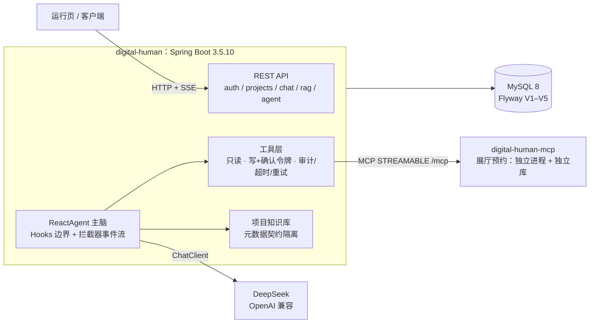

<div align="center">


**18 章系列文章的配套代码仓：每一掌都是一个能跑、能验收、能回滚的闭环。**

不是「跟着敲一遍就完」的示例集合。每掌一条分支、一个 PR、一个 tag，
外加一份贴着**原始输出**（真实模型返回、数据库查询、日志行）的验收记录。

[](https://github.com/lifuchun522/springaialibabapractice/actions/workflows/ci.yml)
[](LICENSE)
[](pom.xml)
[](pom.xml)
[](pom.xml)
[](pom.xml)
[](#一分钟跑起来)
[](.github/pull_request_template.md)

[简体中文](README.md) · [English](README.en.md)

[一分钟跑起来](#一分钟跑起来) · [能学到什么](#能学到什么) · [架构](#架构) · [章节进度](#章节进度) · [文章系列](#文章系列)

</div>

## 为什么值得看这个仓库

官方文档给你 API，系列文章给你思路。但「**把一条链路真正跑通，并对上验收标准**」这段路，
通常是没人陪你走完的：版本对不上、参数语义变了、示例里的写法在当前版本上根本不成立。

这个仓库把十八掌各写成一条可复现的闭环，并且**把偏差写下来**：

| 掌 | 文章里的写法 | 在本仓库实测到的 | 处置 |
|----|--------------|------------------|------|
| 7 | MCP Client 连不上时「工具静默为空」 | 实测直接 `McpTransportException`（404 on `/sse`），行为与文章不同 | 记录差异，并把「清单为空」做成启动期 fail-fast |
| 8 | `similarityThreshold` 控制检索 | 阈值 0 会让「无依据拒答」分支永不触发（得分 0 也会命中） | 向量库宽口径取候选，业务侧另设相关度下限 |
| 9 | 挂框架的工具重试拦截器 | 工具失败已在工具边界被转成可读结果，外层拦截器**永远不会触发** | 失败策略收归工具边界，不让「配了但不生效」的通道留在代码里 |
| 9 | Spring AI Alibaba 与 Spring AI 是一套版本 | `agent-framework → graph-core` 依赖 MCP SDK **0.14.0**，而 Spring AI 1.1.2 用 **0.17.0**；enforcer 直接拦下 | 统一到 0.17.0，并用**真实远程工具调用**证明 graph-core 没被拆坏（也解释了第 7 掌的协议差异根因） |
| 10 | 路由命中率 = 「模型准不准」 | 同一批 20 组样本、同一份口径连跑三轮，命中 **17 / 16 / 16**；而三条「MISS」其实是**我们的标注错**（参观类信息按口径属售前） | 口径写进配置而不是留在脑子里；路由调用固定 `temperature: 0`，重跑两轮判定**逐条完全一致** |
| 11 | 归约策略只是「配一下」 | 并行两条分支写同一个 key 时，`REPLACE` 会**静默丢数据**：没有异常、没有日志，产出从 2 条变 1 条 | 用到的每个 key 都显式声明策略；把「配错会怎样」做成可运行的对照测试 |

这类记录都写在 `docs/chNN-验收记录.md` 的「核验发现与踩坑」里，而不是藏在提交信息里。

## 一分钟跑起来

跑测试**不需要密钥、不需要数据库**（H2 内存库 + 假 ChatModel，全部离线）：

```bash
git clone https://github.com/lifchun522/springaialibabapractice.git
cd springaialibabapractice
./mvnw -B -ntp test
```

真跑一条 Agent 链路需要 MySQL 8 与一个 DeepSeek Key：

```bash
docker run -d --name dh-mysql -e MYSQL_ROOT_PASSWORD=root -p 33079:3306 mysql:8

export DEEPSEEK_API_KEY=sk-xxxx
export DIGITAL_HUMAN_DB_URL='jdbc:mysql://127.0.0.1:33079/digital_human?useUnicode=true&characterEncoding=utf8&serverTimezone=Asia/Shanghai'
export DIGITAL_HUMAN_DB_USER=root
export DIGITAL_HUMAN_DB_PASSWORD=root

./mvnw -pl digital-human spring-boot:run
```

```bash
# 最小一条链路：不建项目、不灌知识，先确认「服务 + 模型通道」是活的
curl -s "http://localhost:8080/api/chat?q=用一句话介绍你自己"
```

```bash
# 第 9 掌的主链路：一句话进，一个字符串出；同时把「走了哪些节点」交给你
# （需要先建项目并灌一份知识，步骤见 docs/ch09-验收记录.md）
curl -s -X POST http://localhost:8080/api/projects/1/agent/chat \
  -H 'Content-Type: application/json' \
  -d '{"question":"深圳展厅的开放时间是几点？周一开放吗？","sessionId":"demo"}'
```

```json
{
  "reply": "深圳展厅每天开放时间是早上九点到晚上六点，不过周一闭馆，所以要避开周一去哦。",
  "traceId": "b68e4df4ff75",
  "modelCalls": 2,
  "events": ["agent.start", "model#1", "tool:knowledge_search", "model#2", "agent.end"]
}
```

`reply` 是给前端的（语音链路 STT → Agent → TTS 不用改），
`events` / `modelCalls` / `traceId` 是给排查的人的——**引入 Agent 框架的第一收益是可观测性，不是答案变好看**。

## 能学到什么

| 掌 | 能力 | 你能亲手验证到什么 |
|----|------|--------------------|
| 1 | 选型与分层 | 业务代码只有 `ChatClient` 一个出口，不出现底层模型对象 |
| 2 | 环境门禁 | JDK / Maven / 依赖收敛过不了 `validate` 阶段，构建直接失败 |
| 3 | 数字人底座 | 注册登录 + 项目 CRUD + 运行页（带 SSE 流式对话） |
| 4 | 模型治理 | provider/model 进数据库、模型目录校验、错误语义确定（400 / 502 / 504） |
| 5 | 记忆与账本 | Memory 是投影、`chat_message` 是事实；取消与失败同样落账 |
| 6 | 工具门禁 | 只读/写工具分离；写操作要**一次性确认令牌**；每次调用有审计、超时与重试 |
| 7 | MCP | 展厅预约拆成独立进程 + 独立库；主应用按远程工具发现与调用 |
| 8 | RAG | 项目级知识库；隔离靠**元数据契约**而不是检索质量；无依据就拒答 |
| 9 | Agent 主脑 | 事件序列完整可看、模型调用有硬上界、工具失败有重试且不中断会话 |

三条最硬的边界（贯穿全仓）：

1. **身份永远不由模型填。** 项目号 / 用户号走 `ToolContext` 旁路，不进工具参数的 JSON Schema——模型看不见，也就填不错。
2. **失败留在工具边界。** 有限次重试 + 兜底结果，把「这个工具现在不可用」交给模型，而不是把整段会话打断。
3. **预算放在工程侧。** 单次请求的模型调用次数有硬上界，超限**显式结束**（不是超时），并留下事件证据。

## 架构



## 技术基线

| 项 | 取值 |
|----|------|
| JDK | 21 LTS（enforcer 强制 `[21,22)`） |
| Maven | 3.9.11，由仓库自带 `./mvnw` 提供（enforcer 强制 `[3.9,)`） |
| Spring Boot | 3.5.10 |
| Spring AI | 1.1.2 |
| Spring AI Alibaba | 1.1.2.2（`v2.0.0-M1.1` 属 Pre-release，只观察不进生产） |
| 模型 | DeepSeek，默认 `deepseek-flash` |
| 数据 | 运行 MySQL 8 + Flyway；测试 H2 内存库 |

基线不是写在文档里就算数：`mvnw` 锁 Maven、`requireJavaVersion` 锁 JDK、
`dependencyConvergence` 锁依赖版本——过不了 `validate` 阶段就构建失败。

模型通道**只有一条**（DeepSeek / OpenAI 兼容协议，`spring.ai.model.chat=openai`，密钥走 `DEEPSEEK_API_KEY`）。
系列基线是 DashScope，但本仓库不引入「引了但不用」的通道，等真正需要它的章节再按章引入。
无密钥时**服务拒绝启动**（SDK 在启动期断言 API Key 非空）——密钥不对，就别让服务假装健康地跑。

## 本地起两个进程（第 7 掌起）

```bash
# 1) MCP Server（它有自己的库）
docker exec -i <mysql> mysql -uroot -proot -e "CREATE DATABASE IF NOT EXISTS digital_human_ext"
MCP_DB_URL='jdbc:mysql://127.0.0.1:33079/digital_human_ext?...' ./mvnw -pl digital-human-mcp spring-boot:run

# 2) 数字人服务（默认连 http://localhost:8081/mcp）
./mvnw -pl digital-human spring-boot:run
```

启动日志里应出现「MCP 远程工具已发现 1 个：`showroom_query_availability`」；
若清单为空且 `digital-human.mcp.fail-fast=true`，服务会**直接启动失败**并说明常见原因。

## 交付方式：Issue → 分支 → PR → main → tag

`main` 始终是最新的可用状态，任何一章都不直接往 `main` 上写：

```text
Issue（本章要落的能力与验收标准）
   └─ 分支 chapter/NN-主题      ← 只做这一章
        └─ PR（关联 Issue，贴真实验证证据）
             └─ 合并进 main → 打 tag chNN
```

提交信息统一 `type(chNN): 中文描述`；标签打在 `main` 上该章的合并提交处，标签信息里写清分支、PR 与本章交付——
「某一掌当时交付了什么」，在 tag 上就能看到，不用翻 PR。

## 章节进度

| 掌 | 卦象 · 主题 | 分支 | 标签 | 状态 |
|----|-------------|------|------|------|
| 1 | 亢龙有悔 · 识势选型 | `chapter/01-value-selection` | `ch01` | ✅ 五层架构 + ChatClient 唯一出口骨架 |
| 2 | 飞龙在天 · 筑基环境 | `chapter/02-baseline-env` | `ch02` | ✅ mvnw + 版本对齐门禁 + 环境自检脚本 |
| 3 | 见龙在田 · 数字人底座 | `chapter/03-digital-human-demo` | `ch03` | ✅ 三张表 + 注册登录 + 项目 CRUD + 运行页 |
| 4 | 鸿渐于陆 · 御模对话 | `chapter/04-chat-model` | `ch04` | ✅ provider 进数据 + 模型目录 + 确定的错误响应 |
| 5 | 潜龙勿用 · 藏忆流式 | `chapter/05-memory-streaming` | `ch05` | ✅ 会话记忆 + SSE 流式 + 消息账本 |
| 6 | 利涉大川 · 御器工具 | `chapter/06-tools` | `ch06` | ✅ 只读/写分离 + 人类确认门禁 + 工具审计与超时 |
| 7 | 突如其来 · 通玄 MCP | `chapter/07-mcp` | `ch07` | ✅ 独立 MCP Server + 远程工具发现与调用 |
| 8 | 震惊百里 · 入藏 RAG | `chapter/08-rag` | `ch08` | ✅ 项目级知识库 + 元数据契约 + 带出处回答与无据拒答 |
| 9 | 或跃在渊 · ReactAgent | `chapter/09-react-agent` | `ch09` | ✅ 事件流 + 模型调用硬上界 + 工具边界重试 + 账本随主脑落 |
| 10 | 双龙取水 · 百阵流程 | `chapter/10-workflow-agents` | `ch10` | ✅ 四类 Flow Agent 编排层 + 节点级埋点（耗时/输出条数/序列） |
| 11 | 鱼跃于渊 · 图谱 Graph | `chapter/11-graph-core` | `ch11` | ✅ 状态图 + 显式归约策略 + 断点中断 + MySQL 检查点（重启可恢复） |
| 12 | 时乘六龙 · 分身多 Agent | `chapter/12-multi-agent` | — | ⬜ 待做 |
| 13 | 密云不雨 · 跨域 A2A | `chapter/13-a2a-nacos` | — | ⬜ 待做 |
| 14 | 损则有孚 · 溯源源码 | `chapter/14-source-pr` | — | ⬜ 待做 |
| 15 | 龙战于野 · 试炼评测 | `chapter/15-eval-guard` | — | ⬜ 待做 |
| 16 | 履霜冰至 · 立派服务 | `chapter/16-spring-service` | — | ⬜ 待做 |
| 17 | 羝羊触藩 · 观星治理 | `chapter/17-observability-admin` | — | ⬜ 待做 |
| 18 | 神龙摆尾 · 登云 K8s | `chapter/18-k8s-production` | — | ⬜ 待做 |

## 文章系列

「降 SpringAI 阿里」十八掌（腾讯云开发者社区，作者：李福春）：

| 掌 | 文章 | 掌 | 文章 |
|----|------|----|------|
| 1 亢龙有悔 | [识势选型](https://cloud.tencent.com/developer/article/2752108) | 10 双龙取水 | [百阵流程](https://cloud.tencent.com/developer/article/2752095) |
| 2 飞龙在天 | [筑基环境](https://cloud.tencent.com/developer/article/2752106) | 11 鱼跃于渊 | [图谱 Graph](https://cloud.tencent.com/developer/article/2752094) |
| 3 见龙在田 | [数字人底座](https://cloud.tencent.com/developer/article/2752105) | 12 时乘六龙 | [分身多 Agent](https://cloud.tencent.com/developer/article/2752093) |
| 4 鸿渐于陆 | [御模对话](https://cloud.tencent.com/developer/article/2752104) | 13 密云不雨 | [跨域 A2A](https://cloud.tencent.com/developer/article/2752092) |
| 5 潜龙勿用 | [藏忆流式](https://cloud.tencent.com/developer/article/2752103) | 14 损则有孚 | [溯源源码](https://cloud.tencent.com/developer/article/2752091) |
| 6 利涉大川 | [御器工具](https://cloud.tencent.com/developer/article/2752102) | 15 龙战于野 | [试炼评测](https://cloud.tencent.com/developer/article/2752089) |
| 7 突如其来 | [通玄 MCP](https://cloud.tencent.com/developer/article/2752101) | 16 履霜冰至 | [立派服务](https://cloud.tencent.com/developer/article/2752087) |
| 8 震惊百里 | [入藏 RAG](https://cloud.tencent.com/developer/article/2752097) | 17 羝羊触藩 | [观星治理](https://cloud.tencent.com/developer/article/2752086) |
| 9 或跃在渊 | [ReactAgent](https://cloud.tencent.com/developer/article/2752096) | 18 神龙摆尾 | [登云 K8s](https://cloud.tencent.com/developer/article/2752084) |

## 同一份内容，三个落点

| 落点 | 读者 | 内容 |
|------|------|------|
| [`docs/chNN-*.md`](docs) | 跟着做的人 | 完整设计文档 + 验收记录（含原始输出与踩坑） |
| [Wiki](https://github.com/lifuchun522/springaialibabapractice/wiki) | 只想看结论的人 | 背景 + 每章一页（从 docs 生成） |
| [Projects](https://github.com/users/lifuchun522/projects/1) | 关心进度的人 | 每章一个条目，状态 Done / In progress / Backlog |

Wiki 与 Projects 两处由脚本生成，**不要手改**（下次生成会覆盖）：`python scripts/build-wiki.py`、
`python scripts/sync-github-project.py`。

## 目录

```text
pom.xml                 父 POM：BOM 统一版本 + enforcer 基线门禁（JDK/Maven/依赖收敛）
mvnw / mvnw.cmd         Maven Wrapper：把 Maven 版本钉在仓库里
digital-human/          数字人应用：ChatClient 出口、工具、记忆、RAG、ReactAgent、MCP Client
digital-human-mcp/      展厅预约 MCP Server：独立进程、独立库（digital_human_ext）
deploy/                 Docker Compose、远程部署脚本、钉钉通知
.github/workflows/      CI（构建+测试）与 release（构建→镜像→部署→通知）
scripts/                环境自检、Wiki 生成、Projects 同步
docs/                   每掌的设计文档与验收记录
```

## 密钥规范

- 真实密钥**只走环境变量**，或放在本地 `.env.local` / `application-local.yml`（均已进 `.gitignore`）。
- 仓库里只允许出现 `.env.example` 这类占位文件，值一律是 `sk-xxxx`。
- 提交前自查：`git diff --cached | findstr sk-`，出现真实 Key 就不要提交。

## 约定

- 框架版本一律由 BOM 管理，子模块不写框架版本号。
- 业务代码只依赖 `ChatClient`，不直接注入底层模型对象。
- 一次提交只对应一掌；提交信息用 `type(chNN): 描述`。
- `.ps1` 脚本保存为 UTF-8 with BOM（PowerShell 5.1 需要）。

## 许可

[Apache License 2.0](LICENSE)。

<div align="center">

如果这个仓库帮你少踩了一个坑，欢迎 **Star** ⭐ 或把踩坑记录提成 Issue —— 文章给思路，仓库给证据。

</div>
