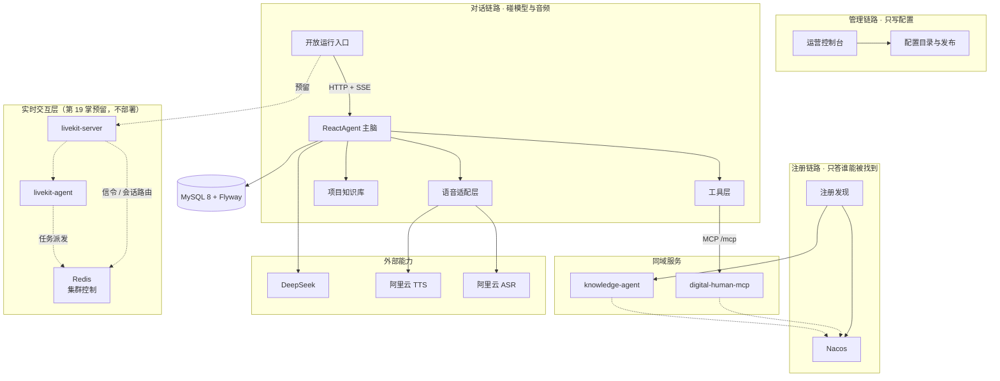

<div align="center">


# 降·Spring AI 阿里 18 掌

**Spring AI 2.0 GA 之后，Java 团队的 Agent 框架该怎么「降」。**

18 篇文章 + 18 集视频的配套代码仓：每一掌都是**一条分支、一个 PR、一个 tag**，
外加一份贴着**原始输出**（真实模型返回、数据库查询、日志行）的验收记录。

[](https://github.com/lifuchun522/springaialibabapractice/actions/workflows/ci.yml)
[](LICENSE)
[](pom.xml)
[](pom.xml)
[](pom.xml)
[](pom.xml)
[](#二快速启动一条命令起全套)
[](.github/pull_request_template.md)

[简体中文](README.md) · [English](README.en.md)

[一、值不值得看](#一值不值得看) · [二、快速启动](#二快速启动一条命令起全套) · [三、18 掌文章与视频](#三18-掌文章与视频) · [四、分支与 tag](#四分支与-tag) · [贡献](CONTRIBUTING.md)

</div>

> **一句话**：这是一套以**数字人项目**为唯一线索的 Spring AI Alibaba 实战系列（生产基线钉在 **v1.1.2.2**），从选型、环境、底座一路打到 K8s 上线，每一掌都给出可验证的完成标准。**系列负责讲「为什么这么定」，本仓库负责把「实测成什么样」摆出来。**
>
> 技术基线由 `validate` 门禁守住：JDK 21 LTS · Spring Boot 3.5.10 · Spring AI 1.1.2 · Spring AI Alibaba 1.1.2.2 · MySQL 8 + Flyway，过不了门禁就构建失败。

## 一、值不值得看

**适合你，如果**：你用 **Java / Spring Boot** 做 AI 或 Agent 应用；你正在 Spring AI、Spring AI Alibaba、AgentScope、LangChain4j 之间选型，需要一份**带证据**的对比口径；你的项目已经「能跑」，但一加需求就要动结构；你要**交付、上线、被评测**，而不只是做个演示。

**不适合你，如果**：你只想找「10 分钟写出第一个 ChatBot」的入门（官方文档更快）；你是 Python 技术栈（除第 7、13 掌的协议部分）；你在找一键可跑的成品框架——这里给的是**契约与判断**。

**按你的角色挑一条线读**（18 掌是一条依赖链，不是 18 篇并列文章：掌 N 用到的契约是掌 N−1 冻住的）：

| 你的角色 | 建议路线 | 走完能拿到 |
| --- | --- | --- |
| 架构师 / 技术负责人 | 第 **1 → 9 → 10 → 13 → 15** 掌 | **决策依据**：Agent 该不该上、上到什么程度、写死编排与自主推理怎么取舍、MCP 与 A2A 的边界画在哪、评测体系怎么建 |
| 后端 / 全栈 | 第 **1 → 2 → 3 → 4 → 5 → 6 → 7 → 8** 掌 | **可直接复用的底座契约**：以 `projectId` 为公共锚点、管理链路与实时链路分离、推理只长在一处 |
| SRE / 平台 / 测试 | 第 **14 → 15 → 16 → 17 → 18** 掌 | **可交付的证据链**：行为由哪一行代码决定 → 五层测试与六类回归集 → 一条 traceId 定位到模型 / 工具 / RAG / 图节点 / 远程 Agent → 发版不掉线、能自愈、能回滚 |

**贯穿全仓的三条硬边界**：

1. **身份永远不由模型填。** 项目号 / 用户号走 `ToolContext` 旁路，不进工具参数的 JSON Schema——模型看不见，也就填不错。
2. **失败留在工具边界。** 有限次重试 + 兜底结果，把「这个工具现在不可用」交给模型，而不是打断整段会话。
3. **预算放在工程侧。** 单次请求的模型调用次数有硬上界，超限**显式结束**（不是超时），并留下事件证据。

**这张图就是本仓库真正在跑的链路**（三条链路分开画，因为「加一个能力该落在哪条链路」是它要回答的第一个问题）：



图注：**实线是真实在跑的链路，虚线是第 19 掌的预留位，不是「已经能用」**——`livekit-server` / `livekit-agent` 需要算法镜像与 GPU，只入图不部署；实时层要做多副本就必须有 `Redis`（两个 livekit 组件的**集群控制**：共享信令路由与任务派发），它同样是预留位、不部署，而且**不承担会话记忆**——记忆的真源始终是 `chat_message` 账本；TTS / ASR 是外部依赖，本仓只交付适配层。

**这里不只抄文档。** 官方文档与文章没写到、实测才暴露的偏差，全部写进 [`docs/chNN-验收记录.md`](docs)（原始输出可复算），举四条：

| 掌 | 实测到的 | 处置 |
|----|----------|------|
| 11 | 并行两条分支写同一个 key 时，`REPLACE` **静默丢数据**：无异常、无日志，产出从 2 条变 1 条 | 用到的每个 key 都显式声明策略，并把「配错会怎样」做成可运行的对照测试 |
| 15 | **判据完全正确的用例被 LLM Judge 判 0 分**：Judge 只拿到判据与回答，看不到资料里本来就写着的事实——看不到事实，就会把事实当编造 | 给 `LlmJudge` 增加 `reference` 形参，把召回的资料原文一起交给它；校准集自带事实来源 |
| 17 | 一次请求出现**两个 traceId**：响应头是自己生成的，日志里却是框架的——Micrometer 的 correlation 装饰器也往同一个 MDC 键写，谁后写谁赢 | 过滤器的身份只留一个来源，修后响应头 == 日志 == 审计表 == 调用树 |
| 18 | 上 K8s 不是「把 replicas 改成 3」：记忆原来是**进程内**的，多副本下请求打到 A、会话在 B，用户看到 AI 失忆 | Memory 改读 `chat_message` 账本（`store=jdbc`），Pod 才真的无状态 |

## 二、快速启动：一条命令起全套

**不需要装 JDK、不需要装 Maven、不需要先建库。** 镜像从源码自己编译，MySQL 一起起，Flyway 迁移在容器里跑完。

```bash
git clone https://github.com/lifuchun522/springaialibabapractice.git
cd springaialibabapractice/deploy

export DEEPSEEK_API_KEY=sk-xxxx
docker compose -f docker-compose.quickstart.yml up -d --build
```

第一次会慢几分钟（下 Maven 与 JRE 基础镜像、装依赖、打包），之后是秒级。起来后三个容器都应是 `healthy`：

```console
$ docker compose -f docker-compose.quickstart.yml ps
NAME            IMAGE                                    STATUS
dh-quick-mysql  mysql:8.0                                Up (healthy)
dh-quick-mcp    saa-quickstart/digital-human-mcp:local   Up (healthy)
dh-quick-app    saa-quickstart/digital-human:local       Up (healthy)
```

**然后用浏览器打开** <http://localhost:8080/run/1>：


这一屏上的东西全是真的，也全是数据：标题与开场白取自 `digital_human_project`，模型名取自 `agent_config`，地址栏里的 `1` 就是 `projectId`——**改开场白不用发版，刷新页面就生效**。

| 想验证什么 | 怎么看 |
| --- | --- |
| 工具真的被 MCP 远程发现了 | `docker compose -f docker-compose.quickstart.yml logs digital-human \| grep 工具` → 出现「MCP 远程工具已发现 1 个：`showroom_query_availability`」 |
| 库表是应用自己迁移出来的 | `docker compose -f docker-compose.quickstart.yml logs digital-human \| grep Migrating` → 出现 V1 起的迁移记录 |
| 只想跑测试、不想起服务 | `./mvnw -B -ntp test`（**离线**：H2 内存库 + 假 `ChatModel`，不需要密钥、不需要数据库） |

常用旋钮都有默认值，不改也能跑：`QUICK_APP_PORT`（8080）、`QUICK_MCP_PORT`（8081）、`QUICK_DB_PORT`（3307）、`QUICK_DB_PASSWORD`；
关掉并清库：`docker compose -f docker-compose.quickstart.yml down -v`。

> `deploy/docker-compose.quickstart.yml` 是**本机体验**用（从源码构建 + 自带 MySQL）；`deploy/docker-compose.yml` 是用**已构建好的镜像**部署（CI 推镜像 → 服务器 `up -d`）。两份不要混用。

### 不想用 Docker：本机起两个进程

```bash
docker run -d --name dh-mysql -e MYSQL_ROOT_PASSWORD=root -p 33079:3306 mysql:8

export DEEPSEEK_API_KEY=sk-xxxx
export DIGITAL_HUMAN_DB_URL='jdbc:mysql://127.0.0.1:33079/digital_human?useUnicode=true&characterEncoding=utf8&serverTimezone=Asia/Shanghai'
export DIGITAL_HUMAN_DB_USER=root
export DIGITAL_HUMAN_DB_PASSWORD=root

./mvnw -pl digital-human spring-boot:run
```

第 7 掌起还有独立的 MCP Server（独立进程、独立库 `digital_human_ext`），主应用默认连 `http://localhost:8081/mcp`。
无密钥时服务**拒绝启动**——密钥不对，就别让服务假装健康地跑。

### 测试分五层，默认只跑离线两层

```bash
./mvnw -B -ntp clean verify                                                                     # L1 单元 + L2 组件（CI 阻断路径）
./mvnw -B -ntp test -pl digital-human -Dsurefire.groups=integration -Dsurefire.excludedGroups=   # L3 真实 MySQL 容器
./mvnw -B -ntp test -pl digital-human -Dsurefire.groups=eval -Dsurefire.excludedGroups=          # L4 真实输出快照重放
./mvnw -B -ntp test -pl digital-human -Dsurefire.groups=eval-live -Dsurefire.excludedGroups=     # L5 在线评测（要 Key）
```

> `groups` 与 `excludedGroups` **必须成对写**：Surefire 里排除优先，只写 `-Dsurefire.groups=integration` 会一条都跑不到，而且构建成功。

## 三、18 掌：文章与视频

18 篇文章与 18 集视频**均已发布在腾讯云开发者社区**（作者：李福春），点开即新页面——建议新开页签，**一篇配一集**。
文章给可复现的细节（环境与版本、依赖与配置、排查过程、完成标准）；视频用「13 人圆桌」推演把这一掌的**决策过程**讲一遍：为什么这么定、否掉了哪些方案、红线画在哪里。单集 3～5 分钟。
也可以在社区直接搜「降SpringAI阿里」看全部 18 集。

| 掌 | 卦象 · 主题 | 读文章 | 看视频 |
|----|-------------|--------|--------|
| 1 | 亢龙有悔 · 识势选型 | [文章](https://cloud.tencent.com/developer/article/2752108) | [视频](https://cloud.tencent.com/developer/video/87798) |
| 2 | 飞龙在天 · 筑基环境 | [文章](https://cloud.tencent.com/developer/article/2752106) | [视频](https://cloud.tencent.com/developer/video/87796) |
| 3 | 见龙在田 · 数字人底座 | [文章](https://cloud.tencent.com/developer/article/2752105) | [视频](https://cloud.tencent.com/developer/video/87794) |
| 4 | 鸿渐于陆 · 御模对话 | [文章](https://cloud.tencent.com/developer/article/2752104) | [视频](https://cloud.tencent.com/developer/video/87793) |
| 5 | 潜龙勿用 · 藏忆流式 | [文章](https://cloud.tencent.com/developer/article/2752103) | [视频](https://cloud.tencent.com/developer/video/87792) |
| 6 | 利涉大川 · 御器工具 | [文章](https://cloud.tencent.com/developer/article/2752102) | [视频](https://cloud.tencent.com/developer/video/87791) |
| 7 | 突如其来 · 通玄 MCP | [文章](https://cloud.tencent.com/developer/article/2752101) | [视频](https://cloud.tencent.com/developer/video/87790) |
| 8 | 震惊百里 · 入藏 RAG | [文章](https://cloud.tencent.com/developer/article/2752097) | [视频](https://cloud.tencent.com/developer/video/87789) |
| 9 | 或跃在渊 · ReactAgent | [文章](https://cloud.tencent.com/developer/article/2752096) | [视频](https://cloud.tencent.com/developer/video/87788) |
| 10 | 双龙取水 · 百阵流程 | [文章](https://cloud.tencent.com/developer/article/2752095) | [视频](https://cloud.tencent.com/developer/video/87787) |
| 11 | 鱼跃于渊 · 图谱 Graph | [文章](https://cloud.tencent.com/developer/article/2752094) | [视频](https://cloud.tencent.com/developer/video/87786) |
| 12 | 时乘六龙 · 分身多 Agent | [文章](https://cloud.tencent.com/developer/article/2752093) | [视频](https://cloud.tencent.com/developer/video/87785) |
| 13 | 密云不雨 · 跨域 A2A | [文章](https://cloud.tencent.com/developer/article/2752092) | [视频](https://cloud.tencent.com/developer/video/87784) |
| 14 | 损则有孚 · 溯源源码 | [文章](https://cloud.tencent.com/developer/article/2752091) | [视频](https://cloud.tencent.com/developer/video/87783) |
| 15 | 龙战于野 · 试炼评测 | [文章](https://cloud.tencent.com/developer/article/2752089) | [视频](https://cloud.tencent.com/developer/video/87782) |
| 16 | 履霜冰至 · 立派服务 | [文章](https://cloud.tencent.com/developer/article/2752087) | [视频](https://cloud.tencent.com/developer/video/87781) |
| 17 | 羝羊触藩 · 观星治理 | [文章](https://cloud.tencent.com/developer/article/2752086) | [视频](https://cloud.tencent.com/developer/video/87797) |
| 18 | 神龙摆尾 · 登云 K8s | [文章](https://cloud.tencent.com/developer/article/2752084) | [视频](https://cloud.tencent.com/developer/video/87795) |

时间只够看三段的话，看这三处（每一处都是「反直觉 + 有证据」）：

1. **实时链路里「少一跳」常常是负优化**（第 3 掌）：实时进程一旦自己直连模型，就会长出第二套上下文和第二套工具注册表——后面每一掌都要改两遍。
2. **模型从来不执行代码，它只写参数**（第 6 掌）：所以**提示词不是安全边界**，能力面的收窄必须靠结构，不能靠语气。
3. **测试的边界就是 mock 的边界**（第 15 掌）：把 `ChatModel` 整个 mock 掉，等于在测试里写死「模型永远返回我们期望的那段文本」，而模型的输出本来就是要被验证的对象。

## 四、分支与 tag

`main` 始终是最新的可用状态，**任何一章都不直接往 `main` 上写**：

```text
Issue（本章要落的能力与验收标准）
   └─ 分支 chapter/NN-主题      ← 只做这一章
        └─ PR（关联 Issue，贴真实验证证据）
             └─ 合并进 main → 打 tag chNN
```

- **分支**：`chapter/NN-主题`，一章一条，只承载这一章的改动。1–14 掌的分支保留在远端，可直接对照；15 掌之后的分支在合并后清理，以 tag 为准。
- **tag**：`chNN`，打在 `main` 上该章的合并提交处。tag 信息里写清了**分支、PR 与本章交付/验证摘要**——`git show ch16 --no-patch` 就能看到「这一掌当时交付了什么、怎么验的」，不用翻 PR。
- **看某一掌的代码**：`git switch --detach ch11`，或 `git diff ch10 ch11` 只看这一掌改了什么。
- **非掌次 tag `v0.1.0`**：仓库运营治理（GitHub Ops：Issue / PR / Discussions / Pages / 安全治理等）首版，与 18 掌无关。
- **第 19 掌**：图与方案已就绪（[ch19 文档](docs/ch19-数字人功能升级.md)、[OpenSpec 变更](openspec/changes/ch19-digital-human-upgrade/)），尚无 tag。

| 掌 | 卦象 · 主题 | 分支 | tag |
|----|-------------|------|-----|
| 1 | 亢龙有悔 · 识势选型 | `chapter/01-value-selection` | `ch01` |
| 2 | 飞龙在天 · 筑基环境 | `chapter/02-baseline-env` | `ch02` |
| 3 | 见龙在田 · 数字人底座 | `chapter/03-digital-human-demo` | `ch03` |
| 4 | 鸿渐于陆 · 御模对话 | `chapter/04-chat-model` | `ch04` |
| 5 | 潜龙勿用 · 藏忆流式 | `chapter/05-memory-streaming` | `ch05` |
| 6 | 利涉大川 · 御器工具 | `chapter/06-tools` | `ch06` |
| 7 | 突如其来 · 通玄 MCP | `chapter/07-mcp` | `ch07` |
| 8 | 震惊百里 · 入藏 RAG | `chapter/08-rag` | `ch08` |
| 9 | 或跃在渊 · ReactAgent | `chapter/09-react-agent` | `ch09` |
| 10 | 双龙取水 · 百阵流程 | `chapter/10-workflow-agents` | `ch10` |
| 11 | 鱼跃于渊 · 图谱 Graph | `chapter/11-graph-core` | `ch11` |
| 12 | 时乘六龙 · 分身多 Agent | `chapter/12-multi-agent` | `ch12` |
| 13 | 密云不雨 · 跨域 A2A | `chapter/13-a2a-nacos` | `ch13` |
| 14 | 损则有孚 · 溯源源码 | `chapter/14-source-pr` | `ch14` |
| 15 | 龙战于野 · 试炼评测 | `chapter/15-eval-guard` | `ch15` |
| 16 | 履霜冰至 · 立派服务 | `chapter/16-spring-service` | `ch16` |
| 17 | 羝羊触藩 · 观星治理 | `chapter/17-observability-admin` | `ch17` |
| 18 | 神龙摆尾 · 登云 K8s | `chapter/18-k8s-production` | `ch18` |
| 19 | 震雷百里 · 数字人功能升级 | 🚧 待开 | — |

## 目录与约定

```text
digital-human/        数字人应用：ChatClient 出口、工具、记忆、RAG、ReactAgent、MCP Client
digital-human-mcp/    展厅预约 MCP Server：独立进程、独立库
knowledge-agent/      A2A 知识 Agent：独立进程、能力声明
deploy/               Docker Compose、K8s 清单、远程部署脚本
docs/                 系列导读 + 每掌的设计文档与验收记录
scripts/              环境自检、Wiki 生成、Projects 同步、各掌证据
```

- 提 Issue / PR 前先读 [CONTRIBUTING.md](CONTRIBUTING.md)；不确定是不是缺陷的，走 [Discussions](https://github.com/lifuchun522/springaialibabapractice/discussions)。
- 真实密钥**只走环境变量**，或放在本地 `.env.local` / `application-local.yml`（均已 gitignore）；仓库里只允许出现 `sk-xxxx` 这类占位。
- 系列导读的唯一来源是 [`docs/系列导读.md`](docs/系列导读.md)；Wiki 与 Projects 由 [`scripts/build-wiki.py`](scripts/build-wiki.py)、[`scripts/sync-github-project.py`](scripts/sync-github-project.py) 生成，**不要手改**。

## 许可

[Apache License 2.0](LICENSE)。

<div align="center">

如果这个仓库帮你少踩了一个坑，欢迎 **Star** ⭐ 或把踩坑记录提成 Issue —— 文章给思路，仓库给证据。

</div>
