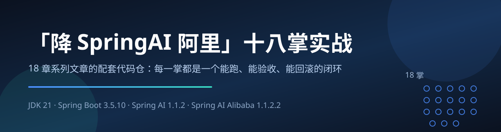
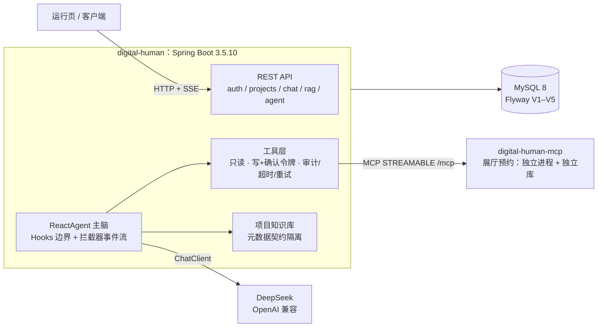

<div align="center">



# 降·Spring AI 阿里 18 掌

**Spring AI 2.0 GA 之后，Java 团队的 Agent 框架该怎么「降」。**

18 篇文章 + 18 集视频的配套代码仓：每一掌都是一个能跑、能验收、能回滚的闭环。

不是「跟着敲一遍就完」的示例集合。每掌一条分支、一个 PR、一个 tag，
外加一份贴着**原始输出**（真实模型返回、数据库查询、日志行）的验收记录。

[](https://github.com/lifuchun522/springaialibabapractice/actions/workflows/ci.yml)
[](LICENSE)
[](pom.xml)
[](pom.xml)
[](pom.xml)
[](pom.xml)
[](#六一分钟跑起来)
[](.github/pull_request_template.md)

[简体中文](README.md) · [English](README.en.md)

[为什么是现在](#一为什么是现在热的不是模型是框架) · [怎么读](#四三条阅读路线别按顺序硬啃) · [18 掌目录](#五18-掌目录文章--视频) · [一分钟跑起来](#六一分钟跑起来) · [能学到什么](#七能学到什么本仓库能核验到什么) · [文章系列](#十文章系列还有三处判断值得单独拎出来)

</div>

> 一句话导读：这是一套以**数字人项目**为唯一线索的 Spring AI Alibaba（锁定 v1.1.2.2 生产基线）实战系列——**18 篇文章 + 18 集视频**，全部已发布在腾讯云开发者社区，从选型、环境、底座一路打到 K8s 上线，每一掌都给出可验证的完成标准。本仓库是这套系列的**练习仓库**：系列负责告诉你「为什么这么定」，仓库负责把「实测成什么样」摆出来。

| 这份内容有三个落点 | 你能拿到什么 |
| --- | --- |
| [Wiki 首页](https://github.com/lifuchun522/springaialibabapractice/wiki) | 系列导读 + 每章一页（交付、发现、遗留问题） |
| **本 README** | 导读 + 仓库实测出来的偏差与证据 |
| [`docs/chNN-*.md`](docs) | 每掌的设计文档与验收记录（含原始输出与踩坑） |
| [Projects](https://github.com/users/lifuchun522/projects/1) | 每章一个条目：Done / In progress / Backlog |

---

## 一、为什么是现在：热的不是模型，是框架

2026 这一年，Java 生态里的 AI 框架发生了三件绕不开的事：

| 时间/事件 | 对我们的实际影响 |
| --- | --- |
| **Spring AI 2.0.0 GA 发布**（[官方公告](https://spring.io/blog/2026/06/12/spring-ai-2-0-0-GA-available-now)） | 基础抽象层进入正式版，Advisor、Tool Calling、MCP、RAG、Observability 全线稳定，Java 团队「接入 AI」的门槛基本消失 |
| **Spring AI Alibaba 1.0 GA + Agent Framework / Graph Runtime**（[官方博客](https://java2ai.com/blog/spring-ai-alibaba-1.0-ga-release/)、[GitHub](https://github.com/alibaba/spring-ai-alibaba)、[文档站](https://java2ai.com)） | Agent 层与图运行时补齐，「Java 只能写 CRUD 调模型」的刻板印象被打破 |
| **开源争鸣：AgentScope Java 2.0、各家 ADK 陆续入场** | 选型从「有没有得选」变成「选错了怎么返工」——**框架选型第一次成为架构决策，而不是依赖坐标** |

结论很直接：**这半年真正卡住 Java 团队的，不是「怎么把模型调通」，而是「调通之后怎么长出 Agent，并且不返工」。**

而网上的内容，绝大多数停在第一站。所以这套系列从**第一站之后的第二站**开始讲；这个仓库就是第二站里的每一条真实提交。

## 二、为什么大多数人卡在同一处：Demo 通，架构不通

如果你现在的代码长这样，这一套就是写给你的：

- System Prompt 拼在 Controller 的字符串里，运营改一句话要发一次版；
- 会话状态躺在一个 `ConcurrentHashMap`，两个浏览器同时打开就串线；
- 想加「查订单」就加一段 `if-else`，加完 RAG 再加一段，加完多 Agent 再 `role` 字段；
- 模型换供应商，改的是 `import` 语句，不是配置；
- 出问题只能看到最终那段文本，看不到走了哪个工具、检索到什么、哪一步走的哪条分支。

第 1 掌给这种现象起了一个名字，并且说明了它为什么会必然发生：**旧方案在「单轮问答」场景下是正确的，一旦需求跨过「有状态 / 多步 / 可中断 / 可观测」这条线，它失效的不是某一段代码，而是整条结构。**

同一个判断换个说法，就是这套系列的取舍原则：

> 选型即边界，边界即成本，成本即架构，架构即取舍。

## 三、「降」是什么意思：不是降级，是把框架压到可控

「降」取的是**降服、收住**的意思，不是降级。整套内容反复在做一件事：**把手里的新技术压到工程可控的范围内**。落在三个具体动作上：

1. **锁版本，不追最新。** 生产基线钉在 **v1.1.2.2**，`v2.0.0-M1.1` 只作为观察线。很多 `NoSuchMethodError` 不是 bug，是选型决策的迟到账单；把 pre-release 用在生产，等于把版本风险转嫁给业务方。本仓库把这条写成了门禁，见[第八节](#八技术基线写在文档里不算数过不了-validate-才算)。
2. **先画边界，再比功能。** 把 Spring AI、Spring AI Alibaba Extensions、Agent Framework、Graph Runtime、Admin/Studio 五层摆正位置，先回答「我这个需求该落在哪一层」，再讨论用哪个模块。
3. **能不加就不加。** 只需要文本补全，Spring AI 基础抽象就够；连多轮对话都不需要，普通 Java 服务加一次 HTTP 调用就是最优解。**框架的价值只在需求跨过阈值时兑现，跨不过去时它就是纯负担。**

## 四、三条阅读路线，别按顺序硬啃

18 掌是**一条依赖链**，不是 18 篇并列的文章。跳着读会踩两个坑：掌 N 用到的契约是掌 N−1 冻住的；掌 N 的「排查」章节复现的是掌 N−1 留下的故障。

| 路线 | 给谁 | 顺序 | 拿到什么 |
|------|------|------|----------|
| **A** | 架构师 / 技术负责人 | 第 1 → 9 → 10 → 13 → 15 掌 | **决策依据**：Agent 该不该上、上到什么程度、写死编排与自主推理怎么取舍、MCP 与 A2A 的边界画在哪、评测体系怎么建 |
| **B** | 后端 / 全栈（已经在做 AI 应用） | 第 1 → 2 → 3 → 4 → 5 → 6 → 7 → 8 掌 | **可直接复用的底座契约**：以 `projectId` 为公共锚点、管理链路与实时链路分离、理解推理只长在一处 |
| **C** | SRE / 平台 / 测试（准备上线交付） | 第 14 → 15 → 16 → 17 → 18 掌 | **可交付的证据链**：行为由哪一行代码决定 → 六类回归集 → 一条 traceId 定位到模型 / Tool / RAG / Graph 节点 / 远程 Agent → 发版不掉线、能自愈、能回滚 |

第 3 掌有一句值得抄在工位上的话：*底座做得越薄，后面加得越快。*

> 本仓库当前已把路线 B 全部走完，路线 A 走到第 12 掌，路线 C 待第 13 掌起推进——进度见[第九节](#九18-掌进度一眼看完哪一掌已经能跑)。

## 五、18 掌目录（文章 + 视频）

> 每掌都是同一套结构：**故事 → 问题 → 原理 → 架构 → 实战一次 → 排查 → 优化 → 洞见 → 系统落地**。文章负责可复现的细节，视频负责把这一掌的推演过程讲清楚。
>
> 文章与视频**均已发布在腾讯云开发者社区**，点击即可打开；视频为竖屏成片，单集 3～5 分钟。文章 ID 与视频 ID 也存在 [`scripts/build-wiki.py`](scripts/build-wiki.py) 里，Wiki 章节页由它生成。

| 掌 | 主题 | 文章 | 视频 |
|----|------|------|------|
| 1 | 亢龙有悔 · 识势选型 | [第 1 掌](https://cloud.tencent.com/developer/article/2752108) | [▶ 87798](https://cloud.tencent.com/developer/video/87798) |
| 2 | 飞龙在天 · 筑基环境 | [第 2 掌](https://cloud.tencent.com/developer/article/2752106) | [▶ 87796](https://cloud.tencent.com/developer/video/87796) |
| 3 | 见龙在田 · 数字人底座 | [第 3 掌](https://cloud.tencent.com/developer/article/2752105) | [▶ 87794](https://cloud.tencent.com/developer/video/87794) |
| 4 | 鸿渐于陆 · 御模对话 | [第 4 掌](https://cloud.tencent.com/developer/article/2752104) | [▶ 87793](https://cloud.tencent.com/developer/video/87793) |
| 5 | 潜龙勿用 · 藏忆流式 | [第 5 掌](https://cloud.tencent.com/developer/article/2752103) | [▶ 87792](https://cloud.tencent.com/developer/video/87792) |
| 6 | 利涉大川 · 御器工具 | [第 6 掌](https://cloud.tencent.com/developer/article/2752102) | [▶ 87791](https://cloud.tencent.com/developer/video/87791) |
| 7 | 突如其来 · 通玄 MCP | [第 7 掌](https://cloud.tencent.com/developer/article/2752101) | [▶ 87790](https://cloud.tencent.com/developer/video/87790) |
| 8 | 震惊百里 · 入藏 RAG | [第 8 掌](https://cloud.tencent.com/developer/article/2752097) | [▶ 87789](https://cloud.tencent.com/developer/video/87789) |
| 9 | 或跃在渊 · ReactAgent | [第 9 掌](https://cloud.tencent.com/developer/article/2752096) | [▶ 87788](https://cloud.tencent.com/developer/video/87788) |
| 10 | 双龙取水 · 百阵流程 | [第 10 掌](https://cloud.tencent.com/developer/article/2752095) | [▶ 87787](https://cloud.tencent.com/developer/video/87787) |
| 11 | 鱼跃于渊 · 图谱 Graph | [第 11 掌](https://cloud.tencent.com/developer/article/2752094) | [▶ 87786](https://cloud.tencent.com/developer/video/87786) |
| 12 | 时乘六龙 · 分身多 Agent | [第 12 掌](https://cloud.tencent.com/developer/article/2752093) | [▶ 87785](https://cloud.tencent.com/developer/video/87785) |
| 13 | 密云不雨 · 跨域 A2A | [第 13 掌](https://cloud.tencent.com/developer/article/2752092) | [▶ 87784](https://cloud.tencent.com/developer/video/87784) |
| 14 | 损则有孚 · 溯源源码 | [第 14 掌](https://cloud.tencent.com/developer/article/2752091) | [▶ 87783](https://cloud.tencent.com/developer/video/87783) |
| 15 | 龙战于野 · 试炼评测 | [第 15 掌](https://cloud.tencent.com/developer/article/2752089) | [▶ 87782](https://cloud.tencent.com/developer/video/87782) |
| 16 | 履霜冰至 · 立派服务 | [第 16 掌](https://cloud.tencent.com/developer/article/2752087) | [▶ 87781](https://cloud.tencent.com/developer/video/87781) |
| 17 | 羝羊触藩 · 观星治理 | [第 17 掌](https://cloud.tencent.com/developer/article/2752086) | [▶ 87797](https://cloud.tencent.com/developer/video/87797) |
| 18 | 神龙摆尾 · 登云 K8s | [第 18 掌](https://cloud.tencent.com/developer/article/2752084) | [▶ 87795](https://cloud.tencent.com/developer/video/87795) |

**视频怎么看**：18 集与 18 篇一一对应，主题相同、侧重不同——**文章**给完整可复现的细节（环境与版本、依赖与配置、排查过程、完成标准）；**视频**用「13 人圆桌」推演的方式把这一掌的**决策过程**讲一遍：为什么这么定、否掉了哪些方案、红线画在哪里。建议的节奏是**先看视频拿到这一掌的取舍，再读文章落代码**；反过来先读文章，容易在细节里迷路而错过决策本身。

## 六、一分钟跑起来

跑测试**不需要密钥、不需要数据库**（H2 内存库 + 假 ChatModel，全部离线）：

```bash
git clone https://github.com/lifuchun522/springaialibabapractice.git
cd springaialibabapractice
./mvnw -B -ntp test
```

真跑一条 Agent 链路需要 MySQL 8 与一个 DeepSeek Key：

```bash
docker run -d --name dh-mysql -e MYSQL_ROOT_PASSWORD=root -p 33079:3306 mysql:8

export DEEPSEEK_API_KEY=sk-xxxx
export DIGITAL_HUMAN_DB_URL='jdbc:mysql://127.0.0.1:33079/digital_human?useUnicode=true&characterEncoding=utf8&serverTimezone=Asia/Shanghai'
export DIGITAL_HUMAN_DB_USER=root
export DIGITAL_HUMAN_DB_PASSWORD=root

./mvnw -pl digital-human spring-boot:run
```

```bash
# 最小一条链路：不建项目、不灌知识，先确认「服务 + 模型通道」是活的
curl -s "http://localhost:8080/api/chat?q=用一句话介绍你自己"
```

```bash
# 第 9 掌的主链路：一句话进，一个字符串出；同时把「走了哪些节点」交给你
# （需要先建项目并灌一份知识，步骤见 docs/ch09-验收记录.md）
curl -s -X POST http://localhost:8080/api/projects/1/agent/chat \
  -H 'Content-Type: application/json' \
  -d '{"question":"深圳展厅的开放时间是几点？周一开放吗？","sessionId":"demo"}'
```

```json
{
  "reply": "深圳展厅每天开放时间是早上九点到晚上六点，不过周一闭馆，所以要避开周一去哦。",
  "traceId": "b68e4df4ff75",
  "modelCalls": 2,
  "events": ["agent.start", "model#1", "tool:knowledge_search", "model#2", "agent.end"]
}
```

`reply` 是给前端的（语音链路 STT → Agent → TTS 不用改），
`events` / `modelCalls` / `traceId` 是给排查的人的——**引入 Agent 框架的第一收益是可观测性，不是答案变好看**。

## 七、能学到什么：本仓库能核验到什么

导读给判断，仓库给证据。每一掌在仓库里都对应一条分支、一个 PR、一个 tag，外加一份贴着原始输出的验收记录：

| 掌 | 能力 | 你能亲手验证到什么 |
|----|------|--------------------|
| 1 | 选型与分层 | 业务代码只有 `ChatClient` 一个出口，不出现底层模型对象 |
| 2 | 环境门禁 | JDK / Maven / 依赖收敛过不了 `validate` 阶段，构建直接失败 |
| 3 | 数字人底座 | 注册登录 + 项目 CRUD + 运行页（带 SSE 流式对话） |
| 4 | 模型治理 | provider/model 进数据库、模型目录校验、错误语义确定（400 / 502 / 504） |
| 5 | 记忆与账本 | Memory 是投影、`chat_message` 是事实；取消与失败同样落账 |
| 6 | 工具门禁 | 只读/写工具分离；写操作要**一次性确认令牌**；每次调用有审计、超时与重试 |
| 7 | MCP | 展厅预约拆成独立进程 + 独立库；主应用按远程工具发现与调用 |
| 8 | RAG | 项目级知识库；隔离靠**元数据契约**而不是检索质量；无依据就拒答 |
| 9 | Agent 主脑 | 事件序列完整可看、模型调用有硬上界、工具失败有重试且不中断会话 |
| 10 | 编排层 | 四类 Flow Agent：顺序 / 并行 / 路由 / 循环，节点级埋点 |
| 11 | 图运行时 | 状态图可导出、可中断、可恢复；归约策略显式声明 |
| 12 | 多 Agent | 三角色各带提示词、工具与记忆；Router 定首跳、交接有上界 |

### 三条最硬的边界（贯穿全仓）

1. **身份永远不由模型填。** 项目号 / 用户号走 `ToolContext` 旁路，不进工具参数的 JSON Schema——模型看不见，也就填不错。
2. **失败留在工具边界。** 有限次重试 + 兜底结果，把「这个工具现在不可用」交给模型，而不是把整段会话打断。
3. **预算放在工程侧。** 单次请求的模型调用次数有硬上界，超限**显式结束**（不是超时），并留下事件证据。

### 下面这些偏差，是仓库实测出来的（不是抄文档）

官方文档给 API，系列文章给思路；但「**把一条链路真正跑通，并对上验收标准**」这段路通常没人陪你走完：版本对不上、参数语义变了、示例写法在当前版本上根本不成立。所以本仓库把偏差写进 `docs/chNN-验收记录.md`，而不是藏在提交信息里：

| 掌 | 文章里的写法 | 在本仓库实测到的 | 处置 |
|----|--------------|------------------|------|
| 7 | MCP Client 连不上时「工具静默为空」 | 实测直接 `McpTransportException`（404 on `/sse`），行为与文章不同 | 记录差异，并把「清单为空」做成启动期 fail-fast |
| 8 | `similarityThreshold` 控制检索 | 阈值 0 会让「无依据拒答」分支永不触发（得分 0 也会命中） | 向量库宽口径取候选，业务侧另设相关度下限 |
| 9 | 挂框架的工具重试拦截器 | 工具失败已在工具边界被转成可读结果，外层拦截器**永远不会触发** | 失败策略收归工具边界，不让「配了但不生效」的通道留在代码里 |
| 9 | Spring AI Alibaba 与 Spring AI 是一套版本 | `agent-framework → graph-core` 依赖 MCP SDK **0.14.0**，而 Spring AI 1.1.2 用 **0.17.0**；enforcer 直接拦下 | 统一到 0.17.0，并用**真实远程工具调用**证明 graph-core 没被拆坏（也解释了第 7 掌的协议差异根因） |
| 10 | 路由命中率 = 「模型准不准」 | 同一批 20 组样本、同一份口径连跑三轮，命中 **17 / 16 / 16**；而三条「MISS」其实是**我们的标注错** | 口径写进配置而不是留在脑子里；路由调用固定 `temperature: 0`，重跑两轮判定**逐条完全一致** |
| 11 | 归约策略只是「配一下」 | 并行两条分支写同一个 key 时，`REPLACE` 会**静默丢数据**：没有异常、没有日志，产出从 2 条变 1 条 | 用到的每个 key 都显式声明策略；把「配错会怎样」做成可运行的对照测试 |
| 12 | 拆多 Agent 是为了「能力更强」 | 三个角色共用工具与记忆时，上下文预算**每轮都要付**（12 个工具的描述与问题是否相关无关）；真实运行里 Router 确实误判过一次 | 工具归属写死成「任何两个角色不共享工具」（可断言）；记忆按 `role:sessionId` 隔离；判据是「一套人格装不下」，不是「工具多」 |

## 八、技术基线：写在文档里不算数，过不了 `validate` 才算



| 项 | 取值 |
|----|------|
| JDK | 21 LTS（enforcer 强制 `[21,22)`） |
| Maven | 3.9.11，由仓库自带 `./mvnw` 提供（enforcer 强制 `[3.9,)`） |
| Spring Boot | 3.5.10 |
| Spring AI | 1.1.2 |
| Spring AI Alibaba | 1.1.2.2（`v2.0.0-M1.1` 属 Pre-release，只观察不进生产） |
| 模型 | DeepSeek，默认 `deepseek-flash` |
| 数据 | 运行 MySQL 8 + Flyway；测试 H2 内存库 |

基线不是写在文档里就算数：`mvnw` 锁 Maven、`requireJavaVersion` 锁 JDK、
`dependencyConvergence` 锁依赖版本——过不了 `validate` 阶段就构建失败（它已经三次拦住真实的版本分叉）。

模型通道**只有一条**（DeepSeek / OpenAI 兼容协议，`spring.ai.model.chat=openai`，密钥走 `DEEPSEEK_API_KEY`）。
系列基线是 DashScope，但本仓库不引入「引了但不用」的通道，等真正需要它的章节再按章引入。
无密钥时**服务拒绝启动**（SDK 在启动期断言 API Key 非空）——密钥不对，就别让服务假装健康地跑。

**本地起两个进程（第 7 掌起）**：

```bash
# 1) MCP Server（它有自己的库）
docker exec -i <mysql> mysql -uroot -proot -e "CREATE DATABASE IF NOT EXISTS digital_human_ext"
MCP_DB_URL='jdbc:mysql://127.0.0.1:33079/digital_human_ext?...' ./mvnw -pl digital-human-mcp spring-boot:run

# 2) 数字人服务（默认连 http://localhost:8081/mcp）
./mvnw -pl digital-human spring-boot:run
```

启动日志里应出现「MCP 远程工具已发现 1 个：`showroom_query_availability`」；
若清单为空且 `digital-human.mcp.fail-fast=true`，服务会**直接启动失败**并说明常见原因。

## 九、18 掌进度：一眼看完哪一掌已经能跑

| 掌 | 卦象 · 主题 | 分支 | 标签 | 状态 |
|----|-------------|------|------|------|
| 1 | 亢龙有悔 · 识势选型 | `chapter/01-value-selection` | `ch01` | ✅ 五层架构 + ChatClient 唯一出口骨架 |
| 2 | 飞龙在天 · 筑基环境 | `chapter/02-baseline-env` | `ch02` | ✅ mvnw + 版本对齐门禁 + 环境自检脚本 |
| 3 | 见龙在田 · 数字人底座 | `chapter/03-digital-human-demo` | `ch03` | ✅ 三张表 + 注册登录 + 项目 CRUD + 运行页 |
| 4 | 鸿渐于陆 · 御模对话 | `chapter/04-chat-model` | `ch04` | ✅ provider 进数据 + 模型目录 + 确定的错误响应 |
| 5 | 潜龙勿用 · 藏忆流式 | `chapter/05-memory-streaming` | `ch05` | ✅ 会话记忆 + SSE 流式 + 消息账本 |
| 6 | 利涉大川 · 御器工具 | `chapter/06-tools` | `ch06` | ✅ 只读/写分离 + 人类确认门禁 + 工具审计与超时 |
| 7 | 突如其来 · 通玄 MCP | `chapter/07-mcp` | `ch07` | ✅ 独立 MCP Server + 远程工具发现与调用 |
| 8 | 震惊百里 · 入藏 RAG | `chapter/08-rag` | `ch08` | ✅ 项目级知识库 + 元数据契约 + 带出处回答与无据拒答 |
| 9 | 或跃在渊 · ReactAgent | `chapter/09-react-agent` | `ch09` | ✅ 事件流 + 模型调用硬上界 + 工具边界重试 + 账本随主脑落 |
| 10 | 双龙取水 · 百阵流程 | `chapter/10-workflow-agents` | `ch10` | ✅ 四类 Flow Agent 编排层 + 节点级埋点（耗时/输出条数/序列） |
| 11 | 鱼跃于渊 · 图谱 Graph | `chapter/11-graph-core` | `ch11` | ✅ 状态图 + 显式归约策略 + 断点中断 + MySQL 检查点（重启可恢复） |
| 12 | 时乘六龙 · 分身多 Agent | `chapter/12-multi-agent` | `ch12` | ✅ 三角色各带提示词/工具/记忆 + Router 首跳 + 自主 handoff + max-hops |
| 13 | 密云不雨 · 跨域 A2A | `chapter/13-a2a-nacos` | — | ⬜ 待做（[文章](https://cloud.tencent.com/developer/article/2752092)与视频已发布） |
| 14 | 损则有孚 · 溯源源码 | `chapter/14-source-pr` | — | ⬜ 待做（[文章](https://cloud.tencent.com/developer/article/2752091)与视频已发布） |
| 15 | 龙战于野 · 试炼评测 | `chapter/15-eval-guard` | — | ⬜ 待做（[文章](https://cloud.tencent.com/developer/article/2752089)与视频已发布） |
| 16 | 履霜冰至 · 立派服务 | `chapter/16-spring-service` | — | ⬜ 待做（[文章](https://cloud.tencent.com/developer/article/2752087)与视频已发布） |
| 17 | 羝羊触藩 · 观星治理 | `chapter/17-observability-admin` | — | ⬜ 待做（[文章](https://cloud.tencent.com/developer/article/2752086)与视频已发布） |
| 18 | 神龙摆尾 · 登云 K8s | `chapter/18-k8s-production` | — | ⬜ 待做（[文章](https://cloud.tencent.com/developer/article/2752084)与视频已发布） |

### 交付方式：Issue → 分支 → PR → main → tag

`main` 始终是最新的可用状态，任何一章都不直接往 `main` 上写：

```text
Issue（本章要落的能力与验收标准）
   └─ 分支 chapter/NN-主题      ← 只做这一章
        └─ PR（关联 Issue，贴真实验证证据）
             └─ 合并进 main → 打 tag chNN
```

提交信息统一 `type(chNN): 中文描述`；标签打在 `main` 上该章的合并提交处，标签信息里写清分支、PR 与本章交付——
「某一掌当时交付了什么」，在 tag 上就能看到，不用翻 PR。

## 十、文章系列：还有三处判断值得单独拎出来

「降 SpringAI 阿里」十八掌（腾讯云开发者社区，作者：李福春）：全 18 篇的**文章与视频直链**见上面的[第五节目录](#五18-掌目录文章--视频)；封面入口是[第 1 掌·识势选型](https://cloud.tencent.com/developer/article/2752108)（[配套视频](https://cloud.tencent.com/developer/video/87798)）——它决定后面 17 掌你能不能少返工。

时间只够看三段的话，看这三处，每一处都是「反直觉 + 有证据」：

1. **实时链路里，「少一跳」常常是负优化**（第 3 掌）：实时进程一旦自己直连模型，就会长出第二套上下文和第二套工具注册表——**后面每一掌都要改两遍**。
2. **模型从来不执行代码，它只写参数**（第 6 掌）：所以**提示词不是安全边界**。System Prompt 里写「请不要随意修改数据」，只是一条概率约束：它降低出事的概率，但不改变出事的能力，能力面的收窄必须靠结构，不能靠语气。
3. **测试的边界就是 mock 的边界**（第 15 掌）：把 `ChatModel` 整个 mock 掉，等于在测试里写死「模型永远会返回我们期望的那段文本」——而模型的输出本来就是要被验证的对象，不是背景条件。

**适合你，如果**：你在做 AI / Agent 应用且技术栈是 Java / Spring Boot；你正在选型 Spring AI、Spring AI Alibaba、AgentScope、LangChain4j，需要一份带证据的对比口径；你的项目已经「能跑」，但一加需求就要动结构，团队不敢往上叠；你要交付、要上线、要被评测，而不只是做个演示。

**不适合你，如果**：你只想找一份「10 分钟写出第一个 ChatBot」的快速入门（官方文档和 examples 更快）；你是 Python 技术栈（除第 7、13 掌的协议部分，其余都是 Spring 侧的工程决策）；你在找一键可跑的成品框架——这套内容给的是**契约与判断**。

> 有底才加层，有层才谈多，有轨才可视，可视才敢上。

## 仓库目录结构

```text
pom.xml                 父 POM：BOM 统一版本 + enforcer 基线门禁（JDK/Maven/依赖收敛）
mvnw / mvnw.cmd         Maven Wrapper：把 Maven 版本钉在仓库里
digital-human/          数字人应用：ChatClient 出口、工具、记忆、RAG、ReactAgent、MCP Client
digital-human-mcp/      展厅预约 MCP Server：独立进程、独立库（digital_human_ext）
deploy/                 Docker Compose、远程部署脚本、钉钉通知
.github/workflows/      CI（构建+测试）与 release（构建→镜像→部署→通知）
scripts/                环境自检、Wiki 生成、Projects 同步
docs/                   系列导读 + 每掌的设计文档与验收记录
```

## 密钥规范

- 真实密钥**只走环境变量**，或放在本地 `.env.local` / `application-local.yml`（均已进 `.gitignore`）。
- 仓库里只允许出现 `.env.example` 这类占位文件，值一律是 `sk-xxxx`。
- 提交前自查：`git diff --cached | findstr sk-`，出现真实 Key 就不要提交。

## 约定

- 框架版本一律由 BOM 管理，子模块不写框架版本号。
- 业务代码只依赖 `ChatClient`，不直接注入底层模型对象。
- 一次提交只对应一掌；提交信息用 `type(chNN): 描述`。
- `.ps1` 脚本保存为 UTF-8 with BOM（PowerShell 5.1 需要）。
- 系列导读的唯一来源是 `docs/系列导读.md`；Wiki（`Home` + 每章一页）与 Projects 由 `scripts/build-wiki.py`、`scripts/sync-github-project.py` 生成，**不要手改**。

## 许可

[Apache License 2.0](LICENSE)。

<div align="center">

如果这个仓库帮你少踩了一个坑，欢迎 **Star** ⭐ 或把踩坑记录提成 Issue —— 文章给思路，仓库给证据。

</div>
