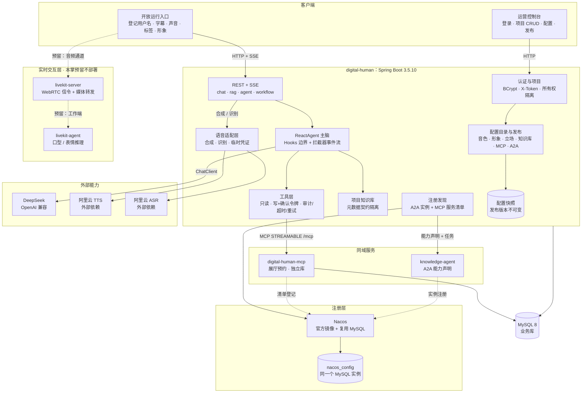
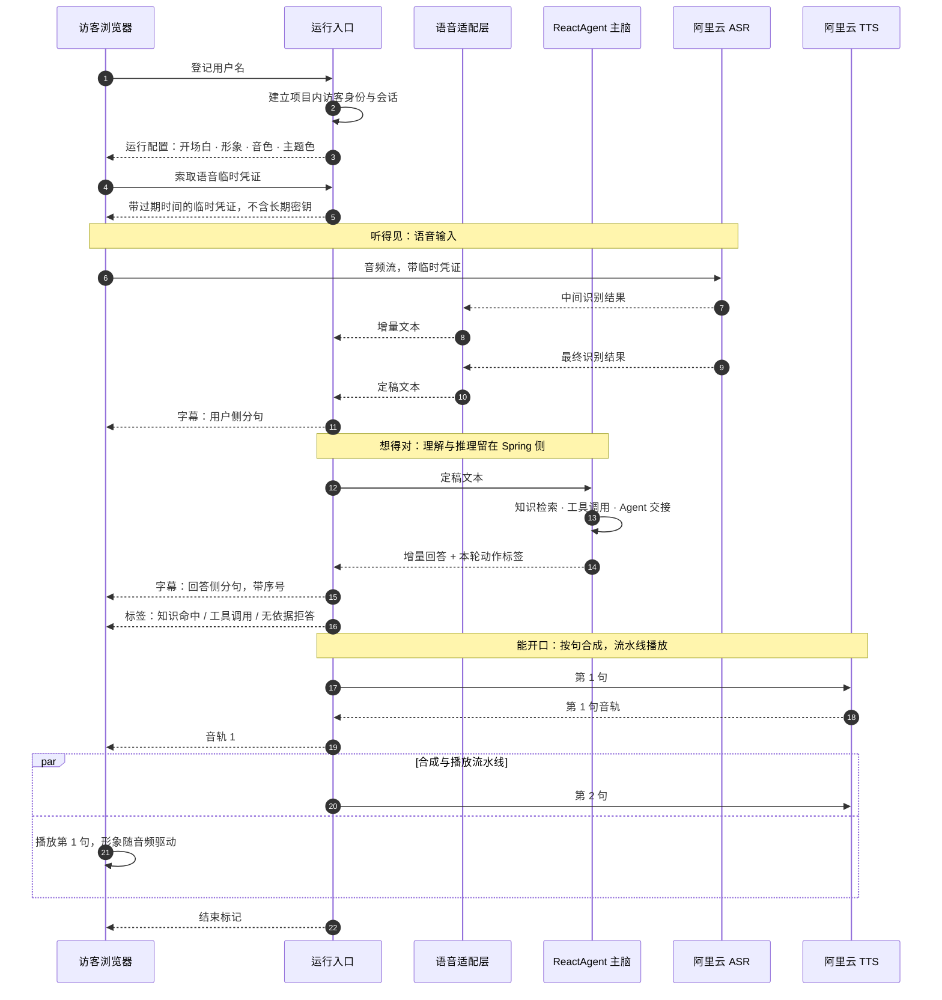
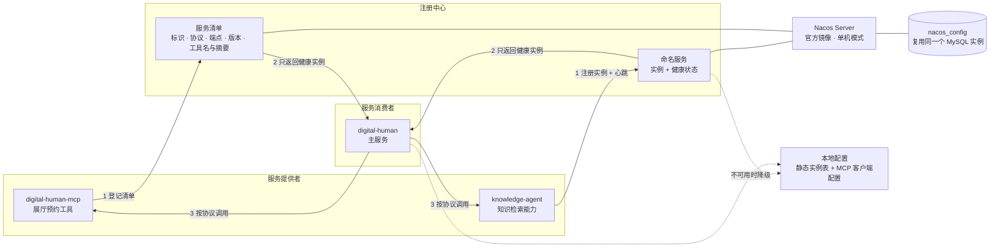
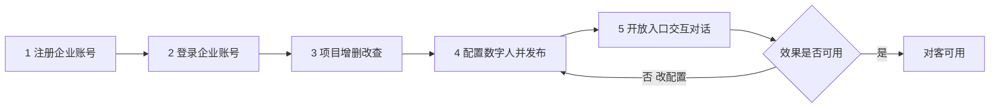
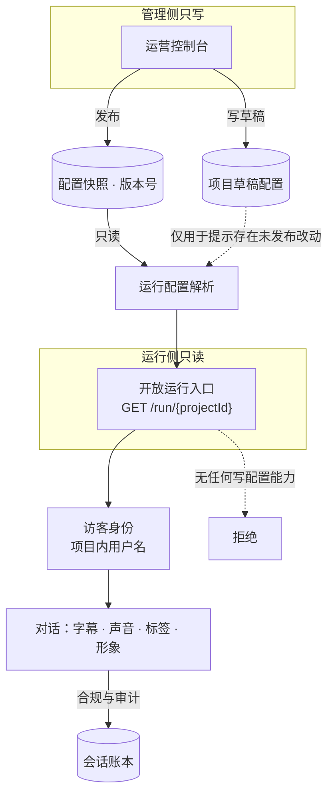
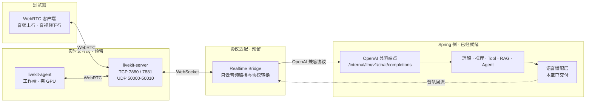

# 第 19 掌 · 震雷百里 · 数字人功能升级：把「能听见、能看见」补进架构

> 分支：`chapter/19-digital-human-upgrade`
> 变更方案：`openspec/changes/ch19-digital-human-upgrade/`
> 前置：第 3 掌（[数字人底座](ch03-数字人底座.md)）已把实时语音链路记为欠账，本掌来还。

## 一、这一掌要解决的问题

第 3 掌把两件事写死了：链路要分成**管理链路**与**实时链路**，且**理解推理必须收回 Spring Boot**。
但当时的交付边界很清楚——只落 Spring 侧的契约，语音链路单独成章。于是留了一笔账：

> **LiveKit 实时语音**：需要 LiveKit Server + Python Bridge 两个额外进程，本掌只把 Spring 侧的契约
> （运行配置 + OpenAI 兼容端点）立好；语音链路的接入单独成章/单独 PR。

第 4 到 15 掌一路推进了对话、工具、MCP、RAG、Agent、Graph、多 Agent、A2A、评测，
**语音这笔账一直没还**。结果是仓库里出现了一种很难察觉的偏差：

- 图上只有一条链路，看起来「数字人」是一个文字对话服务；
- `livekit-agent`、`livekit-server`、`tts`、`asr`、`nacos` 五个组件在代码与编排里都不存在，
  但其中两个（`nacos` 的注册与发现）**代码其实已经写好了**，只是跑不起来；
- 数字人项目能配的只有一句 System Prompt，而「数字人」在业务上必须能配声音、形象、开场白、立场、知识库、外部能力。

这一掌做两件事：**把五个组件放回架构图的正确位置**，并**把「注册」从文档里搬到运行环境里**。

## 二、五组件落位

| # | 组件 | 归属层 | 形态 | 本掌交付到哪一步 |
|---|------|--------|------|------------------|
| 1 | `livekit-server` | 实时交互层 | 开源组件（WebRTC 信令 + 媒体转发，TCP 7880/7881、UDP 50000–50010） | 图上预留（虚线），**不部署** |
| 2 | `livekit-agent` | 实时交互层 | 开源组件（音视频编解码 + 口型/表情推理，需 GPU） | 图上预留（虚线），**不部署** |
| 3 | `tts` | 能力层 | 外部依赖：阿里云智能语音交互 | 适配层真实落地 |
| 4 | `asr` | 能力层 | 外部依赖：阿里云智能语音交互 | 适配层真实落地 |
| 5 | `nacos` | 注册层 | 官方镜像 + **复用同一 MySQL 实例**（新增 `nacos_config` 库） | 真实落地并验收 |

> **为什么两个 livekit 组件画虚线却不部署**：第 3 掌已经论证过实时链路的结构
> （「Web ⇄ LiveKit ⇄ Realtime Bridge ⇄ Spring Boot」），这个结构决策如果不落在图上，
> 后面接手的人会重新长出「Bridge 自己直连模型」的第二套工具注册表。
> 画出来的成本是一行虚线，不画的成本是把第 3 掌的论证重做一遍。
> 但**画出来不等于能跑**——虚线、图注、第八节的非交付清单三处同时声明，不让人误读。

## 三、三条链路：本掌的核心结构决策

第 15 掌之前，「数字人」在图上是一条链路。加了语音与注册之后，如果继续平铺五个框，
会同时丢掉三个信息：**哪些是外部依赖、哪些是自建进程、哪些只是预留**。
所以这张图按链路扩，不按组件清单扩。



图注：这张图回答的是**「加一个能力该落在哪条链路」**。三条链路的判断口径如下。

| 链路 | 范围 | 硬约束 |
|------|------|--------|
| 管理链路 | 控制台 → 认证与项目 → 配置与发布 → 快照 | 只做 CRUD 与鉴权，**不出网、不调模型、不碰音频** |
| 对话链路 | 运行入口 ⇄ SSE ⇄ 主脑 → 模型 / 工具 / 知识 / 语音 | 理解推理只在 Spring 侧生长，工具注册表只有一份 |
| 注册链路 | 各服务 → Nacos ⇄ `nacos_config` | 只承载「谁能被找到」，**不承载业务语义与配置真值** |

**第二条链路的取舍**（延续第 3 掌）：语音是**可以被替换的外部能力**，不是「又一个模型通道」。
所以调用方只依赖标准语音契约，阿里云只出现在一个适配器实现里——
这样「换供应商不改调用方」才是一条可以被证伪的验收项，而不是一句承诺。

**为什么 TTS/ASR 不并进 `spring.ai.model.*` 的选型开关**：语音是**输入输出模态**，
与「用哪个大模型对话」正交。混进模型选型逻辑会让「模型切换」这个已有能力出现语音副作用。

## 四、语音链路：字幕、声音、形象怎么产生



图注：这张图回答的是**「字幕、声音、形象三者凭什么对齐」**。

**按句对齐而不是按字对齐**（关键取舍）：按字对齐要求逐字的强制对齐信息，
而流式合成的可用粒度就是句子边界。按句对齐的代价是字幕会跳变，
收益是**合成与播放可以流水线**——第 2 句在合成时第 1 句已经在播，首句延迟显著更低。
本掌接受「音频实际时长与字幕显示时长不严格相等」这一误差，前端**以音频事件为准推进字幕**，
不按固定时长计时，也不引入强制对齐模型。

**形象驱动的边界**：运行页定义「音频输入 → 形象表现」的驱动契约，本阶段实现为前端驱动
（音频播放时按节奏驱动位移与表情贴图），并提供假数据驱动用于离线测试。
真实口型与表情推理**不在本掌**——它是 `livekit-agent` 那一层的职责，图上已留位。

**凭证只能服务端签发**：浏览器拿到的是带过期时间的临时凭证，长期密钥只存在于服务端环境变量。
这条不是「最佳实践」，是**规格里的硬要求**：未登录索取凭证必须被拒绝，缺密钥时服务必须仍能启动、
文字对话必须仍然可用。

## 五、注册中心：Nacos 从哪里来，边界在哪

现状是一个半成品，值得逐条说清楚它为什么「在文档里是存在的」：

| 现状 | 问题 |
|------|------|
| `knowledge-agent` 有 `NacosRegistrar` | 开关默认 `false`，编排文件里**没有 Nacos** |
| `digital-human` 有 `AgentRegistrySupport` | 默认走静态实例表，Nacos 分支从未真实跑过 |
| `NacosRegistrar` 注册实例时 `instance.setIp("127.0.0.1")` | **硬编码回环地址**，跨机调用必然连不上 |
| 注册成功后只打印「已注册」 | 不证明注册生效——可能登记了但查不回来 |

本掌把这四条一起修掉，并且把 Nacos 的职责从「A2A 发现」升格为 **MCP 与 A2A 的注册管理中心**。



图注：这张图回答的是**「注册中心到底管什么、不管什么」**。

### 管什么

- **实例位置与健康**：谁在哪、还活着没有。调用方只拿健康实例，不健康的不参与分发。
- **服务清单**：服务标识、协议类型、访问端点、版本，外加**工具名与摘要**。

### 不管什么（这条边界是下一次改动的护栏）

**工具参数的完整 schema 不搬进注册中心。** 工具 schema 是模型调用契约的一部分，
真值必须与实现代码同仓同版本。一旦 schema 出现第二处真值，就会出现
「注册中心写了 3 个参数、代码里已经 4 个」这类只在运行期暴露的偏差，
而且排查时两边都「看起来对」。

### 不可用时怎么办

注册中心**不承载业务语义**，所以它挂了不能把业务带走：
调用方退回本地配置的静态实例表与 MCP 客户端配置，并输出**含地址与失败原因**的告警。
「静默退回」是不允许的——静默降级会让运维以为注册中心在正常工作。

这条降级路径在 `AgentRegistrySupport` 里已经写成代码，本掌把它扩到 MCP 侧并**真实验收**。

### 复用一个 MySQL 的代价

本掌的部署形态是「一台机器上的最小闭环」。多起一个 MySQL 意味着多一份备份、多一套账号、
多一处密码轮换，而 Nacos 的数据量极小（配置表 + 服务表）。
代价是数据库故障的影响面从「业务表」扩大到「业务表 + 注册表」——
缓解方式就是上面那条**必须真实可用的降级路径**。

## 六、数字人主流程五步

这五步是业务主线，本掌逐条对齐现状与交付。



图注：这张图回答的是**「业务主线怎么走，以及返工点在哪」**。
第 4 步与第 5 步之间有一条回边——「效果不可用就回去改配置」，
这正是不把配置烘进代码的理由：改一次措辞、换一个音色，都不应该发一次版。

### 第 1–3 步：已实现，本掌复用

| 步 | 现状 | 关键约束（已成立，不重复实现） |
|----|------|------------------------------|
| 1 注册企业账号 | `AuthController` + BCrypt，只存哈希不存明文 | `username` 唯一 |
| 2 登录企业账号 | `X-Token` 头传递 | **令牌是进程内存态，重启失效**——如实记账，不假装能上生产 |
| 3 项目增删改查 | `ProjectService`，带所有权隔离 | 访问他人项目返回**不存在**，不返回「存在但无权限」，避免越权探测 |

### 第 4 步：配置与发布（本掌新建）

要配的七项，以及每项「配了之后谁读它」：

| 配置项 | 可选范围 | 谁读它 |
|--------|----------|--------|
| 音色 | 预置音色目录 | 语音适配层的合成调用 |
| 形象 | 预置形象目录 | 运行页的形象展示与驱动 |
| 开场白 / 结束语 | 自由文本 | 运行页首屏与收尾 |
| 立场 | 自由文本：回答边界与拒答口径 | Agent 的 System Prompt 组装 |
| 知识库 | 该项目可访问的知识库 | RAG 检索入口 |
| MCP | 注册中心清单里的 MCP 服务 | 工具注册表过滤 |
| A2A | 该项目允许的外部 Agent | 跨服务调用范围 |

**发布 = 固化配置快照，而不是改一个状态字段。** 这是设计上最要紧的一条：

```text
草稿配置 ──修改──> 草稿配置（运行实例不受影响）
     │
     └──发布──> 配置快照 v1 ──> 运行入口只读快照
                    │
                    └──再次发布──> 配置快照 v2（v1 仍可查、可回滚）
```

为什么不能「状态字段 + 直接读当前配置」：那样等于没有发布。运营改一次音色，
线上访客的体验立刻变化——这正是发布要消除的风险。代价是一张快照表和一个版本号，
收益是**线上表现可复现、可回滚**。

三条发布前后的行为必须可断言：

1. 发布后修改草稿，运行实例仍走上一次发布的快照；
2. 运行入口提示「存在未发布改动」；
3. 引用了不存在的音色、或无权访问的知识库时，发布被拒绝**且状态保持草稿**。

### 第 5 步：开放入口（本掌新建）

**身份模型：企业账号与访客是两套命名空间。** 访客只登记一个用户名即可开始对话，
用户名按项目隔离。为什么不复用企业账号体系：那会让账号表承担两种语义（内部运营 + 外部访客），
权限边界会随需求变形。代价是两套校验路径，收益是越权探测在入口处就被挡住。

四路输出及其降级行为：

| 输出 | 契约 | 不可用时 |
|------|------|----------|
| 字幕 | 按句分句 + 序号 + 结束标记 | 不适用（文字是底线能力） |
| 声音 | 与字幕分句对应的音轨 | 退化为纯文本，页面显示「当前无语音」，**交互不中断** |
| 标签 | 知识命中 / 工具与 Agent 调用 / 无依据拒答 | 不适用 |
| 形象 | 预置形象 + 主题色 + 音频驱动 | 停在静止状态，**不得持续抖动** |



图注：这张图回答的是**「谁写、谁读、怎么隔离」**。
管理侧只写、运行侧只读；访客身份只在本项目范围内有效，跨项目访问一律拒绝；
同一会话的并发对话请求拒绝后到的那次（沿用既有 `ConversationGuard` 的口径，
避免两次回答交叉写入同一条会话）。

## 七、实时交互层：本掌的预留位长什么样

第 3 掌留下的结构是「Web ⇄ LiveKit ⇄ Realtime Bridge ⇄ Spring Boot」。本掌不改这个结构，
只把它落到图上并说明**接入时要满足什么**。



图注：这张图回答的是**「接入实时链路时，Spring 侧已经准备好了什么」**。

已经就绪的部分**不是本掌做的**，是第 3 掌立下的契约：
`POST /internal/llm/v1/chat/completions` 这个 OpenAI 兼容端点已经存在，
运行配置接口也已经存在。**Realtime Bridge 只做音频编排与协议转换**——
它不直连模型、不自己维护工具注册表。这条约束是第 3 掌最重要的结构决策：
如果 Bridge 自己直连模型，就会长出第二套上下文与第二套工具注册表，后面每一掌都要改两遍。

接入实时链路时需要满足的三条（**明确记为待做，不是本掌的交付**）：

1. `livekit-server` 需要一个公网 IP 与 UDP 端口段，端口规划见第二掌的部署清单；
2. `livekit-agent` 需要 GPU 与算法镜像，与本仓库的构建产物无关；
3. 实时链路启用后，字幕与形象的驱动源从「本掌的前端驱动」换成「Agent 的真实推理输出」，
   **驱动契约不变**——这正是把驱动做成可替换接口的目的。

## 八、明确不交付（记账，不装作已完成）

| 项 | 状态 | 理由与去向 |
|----|------|-----------|
| `livekit-server` / `livekit-agent` 部署 | ⬜ 不做 | 需要算法镜像与 GPU；实时链路接入单独成章，本掌只在图上留位 |
| 真实口型与表情推理 | ⬜ 不做 | 属 `livekit-agent` 那一层；本掌交付前端驱动 + 可替换驱动接口 + 假数据驱动 |
| 令牌持久化 | ⬜ 不做 | 沿用第 3 掌的 Demo 方案，仍是进程内存态，重启失效 |
| Nacos 作为配置中心 | ⬜ 不做 | 本掌只用注册与发现；不往 Nacos 写业务配置，也不读它的配置项 |
| 第二条模型通道 | ⬜ 不做 | TTS/ASR 是能力不是模型通道，不进 `spring.ai.model.chat` 的选型逻辑 |
| 强制对齐模型 | ⬜ 不做 | 字幕按句对齐，以音频事件推进显示；接受「音频时长与字幕时长不严格相等」这一误差 |

## 九、验收口径

沿用第 15 掌的五层测试，**mock 边界撤到 HTTP 层**：

| 层 | 本掌覆盖 |
|----|----------|
| L1 单元 | 配置校验、发布状态机、访客身份、并发拒绝、降级分支 |
| L2 打桩 | 语音适配层的 HTTP/WS 边界；断言「首段音频先于整段完成返回」 |
| L3 集成 | Nacos 真实往返：注册 → 查询 → 注销 → 降级 |
| L4 快照重放 | 发布快照的可复现性：同一快照两次运行结果一致 |
| 截图 | `scripts/shoot-run-page.py` 产出运行页截图，须能看到**字幕与标签两处区域** |

两条特别要求：

1. **Nacos 必须有真实往返证据**——注册中心最容易变成「日志说注册了，实际查不到」，
   所以证据文件里的实例地址必须是可路由地址而不是回环地址，且要包含降级场景的告警原文。
2. **证据里不得出现任何密钥值**——语音能力的验收证据要逐条检查这一点。

离线可跑是硬约束：**注册中心与语音能力都必须可关闭，关闭后服务照常启动**。
CI 不依赖外网，真实调用证据只在本机执行并存进 `scripts/evidence-ch19/`。

## 十、与文章/前序章节的差异（如实记录）

1. **第 3 掌把语音链路记为「单独成章」**，本掌只还其中一半：语音的**能力层**（TTS/ASR）与
   **形态层**（字幕、声音、标签、形象的前端驱动）落地，**实时传输层**（LiveKit）仍为预留。
   这一拆分是刻意的：能力层与传输层可以分别替换，合在一起交付会让「换供应商」这条验收项失效。
2. **`nacos` 的注册与发现代码在第 13 掌就已经写好**，但当时以「本环境没有起 Nacos」为由
   用静态实例表验证。本掌把运行环境补上，并把当时没验的两条（跨机地址、注册结果校验）补验。
3. **本掌新增 OpenSpec 规格**。仓库此前用「章节文档 + 验收记录」承载规格，
   本掌起把**行为契约**（`openspec/`）与**章节叙述**（`docs/`）分开：
   规格回答「系统必须做什么」，章节回答「为什么这么定、实测成什么样」。
4. **本掌新增一道架构图门禁**（`scripts/check-diagrams.py`，已接进 CI）。
   起因就是这次的真实偏差：图里少画了 5 个组件，而当时**没有任何检查会发现它**——
   图是散文，散文不会失败。这道门禁只依赖 Python 标准库，检查四件事：
   五个必需组件是否逐一点名出现在图上、中英两份 README 的图是否漂移、
   被标为「预留」的组件是否同时记在第八节的非交付清单里、每张图是否有图注。
   实测方式很直接：从图上删掉任一必需组件，脚本必须失败并点名它。
